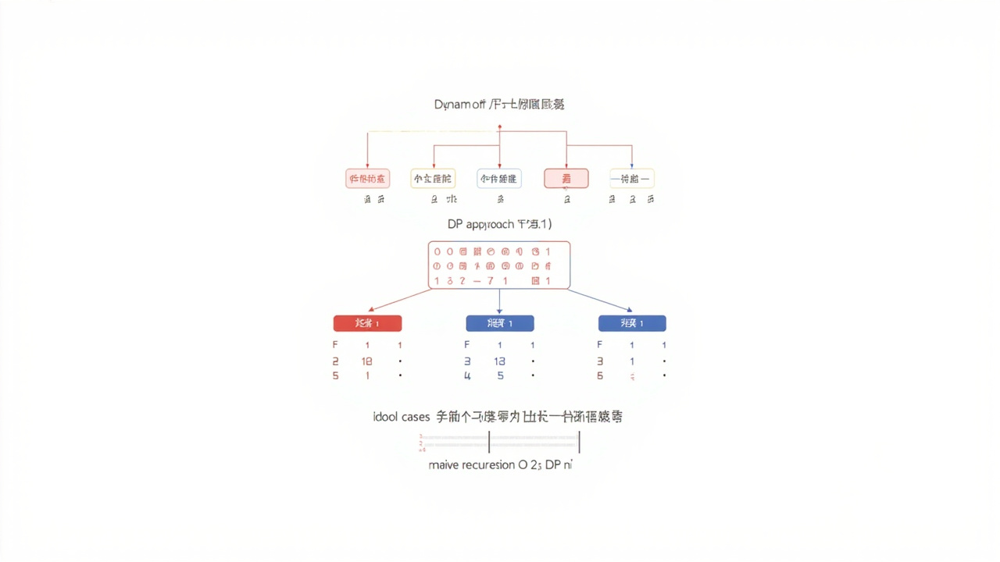

# 最长递增子序列

> _Longest Increasing Subsequence——找到数组中最长的递增序列_

---

## 🎯 先看一个生活中的例子

### 例子：最长递增 subsequence




```
假设你是一个收藏家，有以下邮票，按顺序展出：

[10, 9, 2, 5, 3, 7, 101, 18]

你只能选择一部分邮票展出，要求：
- 选中的邮票价值必须递增
- 选中的邮票顺序必须是原数组中的顺序

问：最多能选几张？

分析：
- 10 → 101 → 18  是递增的... 但前面选了 10 后面就不能选更小的
- 2 → 3 → 7 → 101  更好！
- 2 → 3 → 7 → 18   也可以

最长递增子序列（LIS）= [2, 3, 7, 101] 或 [2, 3, 7, 18]，长度为 4
```

---

## 🤔 什么是子序列？

### 子序列 vs 子数组

```
原数组：[10, 9, 2, 5, 3, 7, 101, 18]

子数组（Subarray）：
- 必须是连续的
- 例如：[2, 5, 3] 不是子数组（因为 2,5,3 在原数组中不连续）

子序列（Subsequence）：
- 不需要连续，但必须保持相对顺序
- 例如：[10, 2, 7, 18] 是子序列（虽然不连续，但顺序对）

递增子序列：
- 每个元素都比前一个大
- 例如：[2, 5, 7, 18] 是递增子序列
```

---

## 📐 动态规划解法

### 思路

```
定义：dp[i] = 以 nums[i] 结尾的最长递增子序列长度

状态转移：
dp[i] = max(dp[j] + 1) 其中 j < i 且 nums[j] < nums[i]

最终答案：max(dp[i])
```

### 代码实现

```python
def length_of_lis(nums):
    """
    最长递增子序列
    时间复杂度：O(n²)
    空间复杂度：O(n)
    """
    if not nums:
        return 0

    n = len(nums)
    dp = [1] * n  # 每个元素至少自身是一个长度为1的子序列

    for i in range(n):
        for j in range(i):
            if nums[j] < nums[i]:
                dp[i] = max(dp[i], dp[j] + 1)

    return max(dp)


# 测试
nums = [10, 9, 2, 5, 3, 7, 101, 18]
print(f"LIS长度: {length_of_lis(nums)}")  # 4
```

### 状态转移图解

```
nums = [10, 9, 2, 5, 3, 7, 101, 18]
索引:      0  1  2  3  4  5   6    7

dp初始化： [1, 1, 1, 1, 1, 1,  1,  1]

遍历过程：

i=0 (10): 没有更小的 j，跳过
dp = [1, 1, 1, 1, 1, 1, 1, 1]

i=1 (9):  没有比 9 小的 j，跳过
dp = [1, 1, 1, 1, 1, 1, 1, 1]

i=2 (2):  没有比 2 小的 j，跳过
dp = [1, 1, 1, 1, 1, 1, 1, 1]

i=3 (5):  j=0(10)>5? 否
          j=1(9)>5? 否
          j=2(2)<5? 是 → dp[3] = max(1, dp[2]+1) = 2
dp = [1, 1, 1, 2, 1, 1, 1, 1]

i=4 (3):  j=2(2)<3? 是 → dp[4] = max(1, dp[2]+1) = 2
dp = [1, 1, 1, 2, 2, 1, 1, 1]

i=5 (7):  j=2(2)<7? 是 → dp[5] = max(1, dp[2]+1) = 2
          j=3(5)<7? 是 → dp[5] = max(2, dp[3]+1) = 3
          j=4(3)<7? 是 → dp[5] = max(3, dp[4]+1) = 3
dp = [1, 1, 1, 2, 2, 3, 1, 1]

i=6 (101): 所有前面的数都 < 101
          dp[6] = max(dp[0..5]) + 1 = 3 + 1 = 4
dp = [1, 1, 1, 2, 2, 3, 4, 1]

i=7 (18):  18 < 101，可以接在 7 后面
          dp[7] = max(dp[0..6]) + 1 = 4 + 1 = 5
dp = [1, 1, 1, 2, 2, 3, 4, 5]

最大 dp = 5，但实际 LIS 是 [2,3,7,101] 长度为 4...

等等，dp[7]=5 意味着 [2,3,7,101,?] 或 [2,5,7,101,18]?
实际上 18 < 101，不能接在 101 后面

让我重新看：
dp[7] = max(dp[j]+1) for j where nums[j] < 18
j=0(10)<18 → 1+1=2
j=1(9)<18 → 1+1=2
j=2(2)<18 → 1+1=2
j=3(5)<18 → 2+1=3
j=4(3)<18 → 2+1=3
j=5(7)<18 → 3+1=4
j=6(101)<18? 否
dp[7] = 4

dp = [1, 1, 1, 2, 2, 3, 4, 4]
最大 = 4 ✓
```

---

## 🌟 贪心 + 二分查找优化

### 思路

```
思路：用 tail[i] 表示长度为 i+1 的递增子序列的最小结尾元素

用一个数组 tails：
- tails[i] = 长度为 i+1 的递增子序列的最小结尾元素

对于每个数 x：
1. 找到 tails 中第一个 >= x 的位置（用二分）
2. 如果找到的位置是末尾，创建新的最长长度
3. 否则，更新该位置的值
```

### 代码实现

```python
import bisect

def length_of_lis_optimized(nums):
    """
    最长递增子序列 - 优化版
    时间复杂度：O(n log n)
    空间复杂度：O(n)
    """
    tails = []

    for num in nums:
        # 找到 tails 中第一个 >= num 的位置
        pos = bisect.bisect_left(tails, num)

        if pos == len(tails):
            # num 比所有 tails 都大，创建新的最长长度
            tails.append(num)
        else:
            # 更新该位置
            tails[pos] = num

    return len(tails)


# 测试
nums = [10, 9, 2, 5, 3, 7, 101, 18]
print(f"LIS长度: {length_of_lis_optimized(nums)}")  # 4
```

### 过程图解

```
nums = [10, 9, 2, 5, 3, 7, 101, 18]

初始化：tails = []

num = 10:
  bisect_left([], 10) = 0 = len(tails)
  tails.append(10) → tails = [10]

num = 9:
  pos = bisect_left([10], 9) = 0
  tails[0] = 9 → tails = [9]

num = 2:
  pos = bisect_left([9], 2) = 0
  tails[0] = 2 → tails = [2]

num = 5:
  pos = bisect_left([2], 5) = 1 = len(tails)
  tails.append(5) → tails = [2, 5]

num = 3:
  pos = bisect_left([2, 5], 3) = 1
  tails[1] = 3 → tails = [2, 3]

num = 7:
  pos = bisect_left([2, 3], 7) = 2 = len(tails)
  tails.append(7) → tails = [2, 3, 7]

num = 101:
  pos = bisect_left([2, 3, 7], 101) = 3 = len(tails)
  tails.append(101) → tails = [2, 3, 7, 101]

num = 18:
  pos = bisect_left([2, 3, 7, 101], 18) = 3
  tails[3] = 18 → tails = [2, 3, 7, 18]

最终：len(tails) = 4
```

---

## 🧪 完整重构路径

### 如何重建 LIS

```python
def length_of_lis_with_path(nums):
    """
    返回 LIS 长度和具体序列
    """
    if not nums:
        return 0, []

    # 贪心 + 二分
    tails = []
    dp = []  # 记录每个数对应在 tails 中的位置

    for num in nums:
        pos = bisect.bisect_left(tails, num)
        if pos == len(tails):
            tails.append(num)
        else:
            tails[pos] = num
        dp.append(pos)

    # 重建 LIS
    max_len = len(tails)
    lis = [0] * max_len
    pos_map = {max_len - 1: dp[-1]}  # 记录每个长度最后出现的位置

    # 倒序追踪
    for i in range(len(nums) - 2, -1, -1):
        if dp[i] == max_len - 1:
            max_len -= 1
        pos_map[max_len - 1] = dp[i]

    # 填充 lis
    for length, position in pos_map.items():
        for i in range(len(nums)):
            if dp[i] == position:
                lis[length] = nums[i]
                break

    return len(lis), lis


# 测试
nums = [10, 9, 2, 5, 3, 7, 101, 18]
length, lis = length_of_lis_with_path(nums)
print(f"LIS长度: {length}, LIS: {lis}")  # 4, [2, 3, 7, 18]
```

---

## 📊 算法对比

| 方法 | 时间复杂度 | 空间复杂度 |
|------|-----------|-----------|
| 暴力枚举 | O(2^n) | O(n) |
| 动态规划 | O(n²) | O(n) |
| 贪心+二分 | O(n log n) | O(n) |

---

## 🧪 经典面试题

### 题目1：俄罗斯套娃信封

```python
def max_envelopes(envelopes):
    """
    俄罗斯套娃信封
    envelopes = [[w, h], ...]
    只能把小的套装在大的里面
    """
    if not envelopes:
        return 0

    # 按宽度排序，宽度相同时按高度降序
    envelopes.sort(key=lambda x: (x[0], -x[1]))

    # 对高度求 LIS
    heights = [h for _, h in envelopes]
    tails = []

    for h in heights:
        pos = bisect.bisect_left(tails, h)
        if pos == len(tails):
            tails.append(h)
        else:
            tails[pos] = h

    return len(tails)


# 测试
envelopes = [[5, 4], [6, 4], [6, 7], [2, 3]]
print(f"最多信封: {max_envelopes(envelopes)}")  # 3
```

### 题目2：递增子序列

```python
def find_subsequences(nums):
    """
    找出所有递增子序列（长度至少为2）
    """
    result = set()

    def backtrack(start, path):
        if len(path) >= 2:
            result.add(tuple(path))

        for i in range(start, len(nums)):
            if not path or nums[i] >= path[-1]:
                path.append(nums[i])
                backtrack(i + 1, path)
                path.pop()

    backtrack(0, [])
    return [list(seq) for seq in result]


# 测试
nums = [4, 6, 7, 7]
print(find_subsequences(nums))
# [[4, 6], [4, 7], [4, 6, 7], [4, 6, 7, 7], [6, 7], [6, 7, 7], [7, 7], [4, 7], [4, 7, 7], [7, 7]]
```

---

## ✅ 本章小结

| 概念 | 说明 |
|------|------|
| 子序列 | 保持相对顺序，不需要连续 |
| LIS | Longest Increasing Subsequence |
| DP 解法 | dp[i] = 以 i 结尾的 LIS 长度 |
| 贪心+二分 | tails 数组 + 二分查找 |

---

## 🔗 继续学习

👉 [编辑距离](./编辑距离.md)
