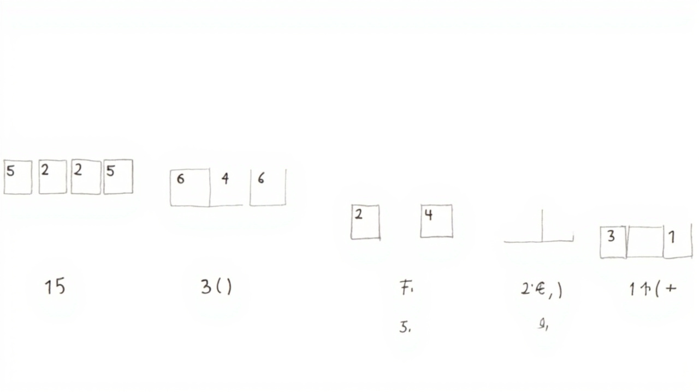

# 插入排序

_像整理扑克牌一样自然_

---

## 📖 学习目标

1. 理解插入排序的原理



2. 掌握扑克牌整理思想
3. 理解为什么对基本有序数据效率高

---

## 第一部分：什么是插入排序？

### 🃏 扑克牌的故事

想象你手里有一副牌：
- 左手拿着已经排好序的牌
- 右手摸一张新牌
- 把新牌插入到左手中合适的位置

**这就是插入排序的核心思想！**

---

## 第二部分：图解过程

### 例子：将 [4, 3, 2, 1] 排序

```
初始状态：[4] [3, 2, 1]
          ↓
第1轮：摸到 3，插入到 [4] 中合适位置
       [2, 4] [1]

第2轮：摸到 2，插入到 [2, 4] 中合适位置
       [2, 3, 4] []

第3轮：摸到 1，插入到 [1, 2, 3, 4] 中合适位置
       [1, 2, 3, 4]

排序完成！
```

---

## 第三部分：代码逐行解释

```python
def insertion_sort(arr):
    """
    插入排序

    参数:
        arr: 待排序列表（原地修改）
    返回值:
        排序后的列表
    """

    # -------- 遍历所有元素，逐个插入 --------
    for i in range(1, len(arr)):

        # -------- 保存当前要插入的元素 --------
        current = arr[i]

        # -------- 从已排序部分的末尾开始比较 --------
        j = i - 1

        # -------- 寻找插入位置 --------
        while j >= 0 and arr[j] > current:
            arr[j + 1] = arr[j]  # 往后移动一位
            j -= 1

        # -------- 插入到正确位置 --------
        arr[j + 1] = current

    return arr
```

---

## 第四部分：实际运行代码

```python
def insertion_sort(arr):
    for i in range(1, len(arr)):
        current = arr[i]
        j = i - 1
        while j >= 0 and arr[j] > current:
            arr[j + 1] = arr[j]
            j -= 1
        arr[j + 1] = current
    return arr


# ========================== 测试 ==========================

print("测试1：简单数字排序")
arr1 = [5, 2, 4, 6, 1, 3]
print(f"  排序前: {arr1}")
print(f"  排序后: {insertion_sort(arr1)}")
# 输出: [1, 2, 3, 4, 5, 6]

print("\n测试2：基本有序的数组")
almost_sorted = [1, 2, 4, 3, 5, 6]
print(f"  排序前: {almost_sorted}")
print(f"  排序后: {insertion_sort(almost_sorted)}")
```

---

## 第五部分：实际应用场景

### 🃏 场景1：扑克牌整理

```python
# 手牌：[3, 5, 7, 9]
# 摸到 6，插入后：[3, 5, 6, 7, 9]
```

### 📚 场景2：图书馆还书

每还一本书，找到合适位置插回书架。

---

## 第六部分：插入排序 vs 其他排序

| 特点 | 插入排序 | 快速排序 | 归并排序 |
|------|----------|----------|----------|
| 时间复杂度 | O(n²) | O(n log n) | O(n log n) |
| 空间复杂度 | O(1) | O(log n) | O(n) |
| 稳定性 | ✅ 稳定 | ❌ 不稳定 | ✅ 稳定 |

### 插入排序的优势

```
✅ 对基本有序的数据，效率接近 O(n)
✅ 适合小规模数据（n < 50）
✅ 适合持续添加新数据的场景
```

---

## 第七部分：名词解释

### 有序区 vs 无序区

```
[2, 4, 5, 6] | [3, 1]  ← 左边有序，右边无序
```

### 原地排序

**定义：** 不需要额外数组，只用给定的数组进行排序。

---

## ✅ 小结

1. **插入排序**像整理扑克牌
2. 逐个元素插入到已排序部分
3. **对基本有序数据效率很高**
4. 是稳定的排序算法

---

_继续学习：下一章「选择排序」_
