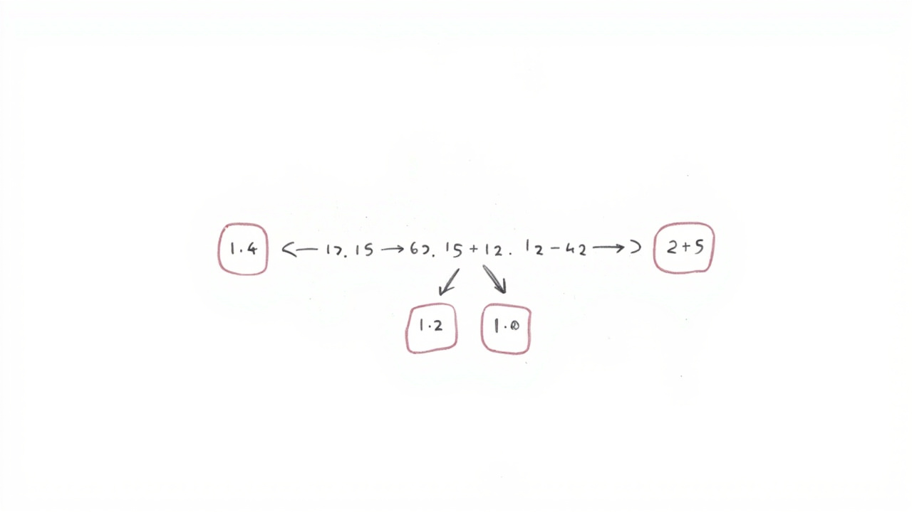

# 选择排序

_每轮选出最小的一个_

---

## 📖 学习目标

1. 理解选择排序的原理



2. 掌握找最小值的方法
3. 理解不稳定排序的概念

---

## 第一部分：什么是选择排序？

### 🎯 核心思想

**每一轮在未排序部分找到最小的，放到已排序部分的末尾。**

```
第1轮：在所有元素中找到最小的，放到第1位
第2轮：在剩余元素中找到最小的，放到第2位
...
直到所有元素都排好序
```

---

## 第二部分：图解过程

```
原数组：[5, 3, 8, 1, 4]

i=0: 在 [5,3,8,1,4] 中找最小 → 1，与 arr[0] 交换
     [1, 3, 8, 5, 4]

i=1: 在 [3,8,5,4] 中找最小 → 3，无需交换
     [1, 3, 8, 5, 4]

i=2: 在 [8,5,4] 中找最小 → 4，与 arr[2] 交换
     [1, 3, 4, 5, 8]

排序完成！
```

---

## 第三部分：代码逐行解释

```python
def selection_sort(arr):
    """
    选择排序

    参数:
        arr: 待排序列表（原地修改）
    返回值:
        排序后的列表
    """

    n = len(arr)

    # -------- 外层循环：控制轮数 --------
    for i in range(n):

        # -------- 假设当前位置是最小值 --------
        min_index = i

        # -------- 内层循环：在未排序部分找最小值 --------
        for j in range(i + 1, n):
            if arr[j] < arr[min_index]:
                min_index = j

        # -------- 把最小值交换到位置 i --------
        if min_index != i:
            arr[i], arr[min_index] = arr[min_index], arr[i]

    return arr
```

---

## 第四部分：实际运行代码

```python
def selection_sort(arr):
    n = len(arr)
    for i in range(n):
        min_index = i
        for j in range(i + 1, n):
            if arr[j] < arr[min_index]:
                min_index = j
        if min_index != i:
            arr[i], arr[min_index] = arr[min_index], arr[i]
    return arr


# ========================== 测试 ==========================

print("测试1：简单数字排序")
arr1 = [64, 25, 12, 22]
print(f"  排序前: {arr1}")
print(f"  排序后: {selection_sort(arr1)}")
# 输出: [12, 22, 25, 64]
```

---

## 第五部分：实际应用场景

### 🏆 场景1：选秀节目海选排名

```python
# 每轮选出当前最高分的选手
contestants = [85, 92, 78, 96, 88, 73]
```

### 📊 场景2：成绩筛选

找出最低分的几个学生。

---

## 第六部分：选择排序 vs 其他排序

| 特点 | 选择排序 | 冒泡排序 | 插入排序 |
|------|----------|----------|----------|
| 时间复杂度 | O(n²) | O(n²) | O(n²) |
| 交换次数 | O(n) ⭐ | O(n²) | O(n²) |
| 稳定性 | ❌ 不稳定 | ✅ 稳定 | ✅ 稳定 |

### 为什么选择排序不稳定？

```
原始数组：[2₁, 3, 2₂, 1]
第1轮：找到最小值 1，与 arr[0] 交换
      [1, 3, 2₂, 2₁]
注意：两个 2 的相对位置变了！这就是"不稳定"！
```

---

## 第七部分：名词解释

### 不稳定排序

**定义：** 排序后，相等元素的相对位置可能改变。

---

## ✅ 小结

1. **选择排序**每轮找未排序部分的最小值
2. 把最小值交换到已排序部分末尾
3. **交换次数少**（最多 n-1 次）
4. **不稳定**排序

---

_继续学习：下一章「快速排序」_
