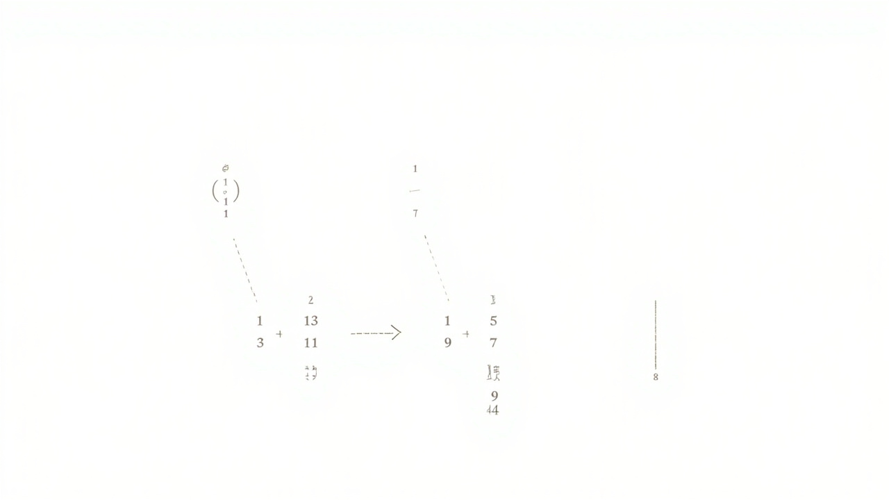

# 二分搜索

> _猜数字游戏的奥秘——每次排除一半，效率翻倍_

---

## 🎯 先看一个生活中的例子

### 猜数字游戏




假设你在玩一个猜数字游戏：
- 我想一个 1 到 100 之间的数字
- 你来猜，我告诉你猜大了还是猜小了

**普通人的玩法（线性搜索）：**
```
猜 1 → 不对，太小了
猜 2 → 不对，太小了
猜 3 → 不对，太小了
...
一直猜到 73 才猜对！
运气差的话可能要猜 100 次！
```

**聪明人的玩法（二分搜索）：**
```
猜 50 → 太大了，排除 51-100（还剩 50 个）
猜 25 → 太小了，排除 1-25（还剩 25 个）
猜 37 → 太大了，排除 38-50（还剩 12 个）
猜 31 → 太小了，排除 25-31（还剩 6 个）
猜 34 → 太大了，排除 35-37（还剩 3 个）
猜 32 → 太小了，排除 32-34（还剩 2 个）
猜 33 → 对了！
只猜了 7 次就找到了！
```

**结论：二分搜索只需要 log₂(N) 次就能找到！**

---

## 🤔 什么是二分搜索？

### 二分搜索的前提条件

```
1. 数据必须是有序的！（升序或降序）
2. 数据必须能够通过索引随机访问！（数组可以，链表不行）
```

### 二分搜索的核心思想

```
1. 确定搜索范围的左右边界：left = 0, right = len(arr) - 1
2. 取中间位置的元素：mid = (left + right) // 2
3. 比较中间元素和目标值：
   - 如果相等，找到了！
   - 如果中间值 < 目标值，目标在右半部分，left = mid + 1
   - 如果中间值 > 目标值，目标在左半部分，right = mid - 1
4. 重复步骤 2-3，直到 left > right（没找到）
```

---

## 📐 图解二分搜索过程

### 有序数组中查找 11

```
数组：[1, 3, 5, 7, 9, 11, 13, 15, 17, 19]
索引： 0  1  2  3  4   5   6   7   8   9
目标：11

━━━━━━━━━━━━━━━━━━━━━━━━━━━━━━━━━━━━━━━━━━━━━━━━━━━

Step 1：初始状态
left=0, right=9, mid=4

    left                         right
     ↓                            ↓
     1  3  5  7  9  11  13  15  17  19
              ↑
             mid=4, arr[4]=9 < 11
             → 目标在右半部分，left = mid + 1 = 5

━━━━━━━━━━━━━━━━━━━━━━━━━━━━━━━━━━━━━━━━━━━━━━━━━━━

Step 2：
left=5, right=9, mid=7

                    left          right
                     ↓              ↓
     1  3  5  7  9  11  13  15  17  19
                       ↑              ↑
                      mid=7, arr[7]=15 > 11
                      → 目标在左半部分，right = mid - 1 = 6

━━━━━━━━━━━━━━━━━━━━━━━━━━━━━━━━━━━━━━━━━━━━━━━━━━━

Step 3：
left=5, right=6, mid=5

                    left  right
                     ↓      ↓
     1  3  5  7  9  11  13  15  17  19
                       ↑
                      mid=5, arr[5]=11 == 11
                      → 找到了！返回索引 5
```

### 查找不存在的元素 6

```
数组：[1, 3, 5, 7, 9, 11, 13, 15, 17, 19]
目标：6

━━━━━━━━━━━━━━━━━━━━━━━━━━━━━━━━━━━━━━━━━━━━━━━━━━━

Step 1：
left=0, right=9, mid=4

     1  3  5  7  9  11  13  15  17  19
              ↑
         arr[4]=9 > 6, right = 4 - 1 = 3

━━━━━━━━━━━━━━━━━━━━━━━━━━━━━━━━━━━━━━━━━━━━━━━━━━━

Step 2：
left=0, right=3, mid=1

     1  3  5  7  9  11  13  15  17  19
        ↑
    arr[1]=3 < 6, left = 1 + 1 = 2

━━━━━━━━━━━━━━━━━━━━━━━━━━━━━━━━━━━━━━━━━━━━━━━━━━━

Step 3：
left=2, right=3, mid=2

     1  3  5  7  9  11  13  15  17  19
           ↑
       arr[2]=5 < 6, left = 2 + 1 = 3

━━━━━━━━━━━━━━━━━━━━━━━━━━━━━━━━━━━━━━━━━━━━━━━━━━━

Step 4：
left=3, right=3, mid=3

     1  3  5  7  9  11  13  15  17  19
              ↑
      arr[3]=7 > 6, right = 3 - 1 = 2

━━━━━━━━━━━━━━━━━━━━━━━━━━━━━━━━━━━━━━━━━━━━━━━━━━━

Step 5：
left=3, right=2

left > right，搜索结束！
返回 -1（没找到）
```

---

## 💻 代码实现

### 基础版本

```python
def binary_search(arr, target):
    """
    二分搜索基础版

    参数:
        arr: 有序数组
        target: 目标值
    返回:
        目标值的索引，如果没找到返回 -1
    """
    left = 0
    right = len(arr) - 1

    while left <= right:
        # 防止整数溢出（在 Java/C++ 中 left+right 可能超出 int 范围）
        mid = left + (right - left) // 2

        if arr[mid] == target:
            return mid
        elif arr[mid] < target:
            left = mid + 1  # 目标在右半部分
        else:
            right = mid - 1  # 目标在左半部分

    return -1  # 没找到


# 测试
arr = [1, 3, 5, 7, 9, 11, 13, 15, 17, 19]

print(f"查找 11: 索引 {binary_search(arr, 11)}")  # 5
print(f"查找 6:  索引 {binary_search(arr, 6)}")   # -1
print(f"查找 1:  索引 {binary_search(arr, 1)}")   # 0
print(f"查找 19: 索引 {binary_search(arr, 19)}")  # 9
```

### 查找左边界（第一个 >= target 的位置）

```python
def bisect_left(arr, target):
    """
    查找左边界：第一个 >= target 的元素索引

    等价于 Python 内置的 bisect.bisect_left
    """
    left = 0
    right = len(arr)

    while left < right:
        mid = left + (right - left) // 2
        if arr[mid] < target:
            left = mid + 1
        else:
            right = mid

    return left


# 测试
arr = [1, 3, 5, 5, 5, 7, 9, 11]

print(f"找 5 的左边界: {bisect_left(arr, 5)}")   # 2（第一个 5 的位置）
print(f"找 4 的左边界: {bisect_left(arr, 4)}")   # 2（第一个 >= 4 的位置）
print(f"找 6 的左边界: {bisect_left(arr, 6)}")   # 6（第一个 >= 6 的位置）
print(f"找 0 的左边界: {bisect_left(arr, 0)}")   # 0
print(f"找 20 的左边界: {bisect_left(arr, 20)}") # 8（超出范围）
```

### 查找右边界（第一个 > target 的位置）

```python
def bisect_right(arr, target):
    """
    查找右边界：第一个 > target 的元素索引

    等价于 Python 内置的 bisect.bisect_right
    """
    left = 0
    right = len(arr)

    while left < right:
        mid = left + (right - left) // 2
        if arr[mid] <= target:
            left = mid + 1
        else:
            right = mid

    return left


# 测试
arr = [1, 3, 5, 5, 5, 7, 9, 11]

print(f"找 5 的右边界: {bisect_right(arr, 5)}")   # 5（第一个 > 5 的位置）
print(f"找 4 的右边界: {bisect_right(arr, 4)}")   # 2（第一个 > 4 的位置）
print(f"找 6 的右边界: {bisect_right(arr, 6)}")   # 6（第一个 > 6 的位置）
```

### Python 内置库

```python
import bisect

arr = [1, 3, 5, 5, 5, 7, 9, 11]

# bisect_left: 第一个 >= target 的位置
idx = bisect.bisect_left(arr, 5)  # 2

# bisect_right: 第一个 > target 的位置
idx = bisect.bisect_right(arr, 5)  # 5

# bisect: 默认是 bisect_right
idx = bisect.bisect(arr, 5)  # 5

# 插入操作（保持有序）
bisect.insort(arr, 4)  # 在正确位置插入 4
```

---

## 🔢 二分搜索的变体

### 变体1：查找旋转排序数组中的元素

```python
def search_rotated(nums, target):
    """
    搜索旋转排序数组

    例如：[4,5,6,7,0,1,2] 是 [0,1,2,4,5,6,7] 旋转了 4 次

    思路：二分 + 判断哪半边是有序的
    """
    left = 0
    right = len(nums) - 1

    while left <= right:
        mid = left + (right - left) // 2

        if nums[mid] == target:
            return mid

        # 判断左半边是否有序
        if nums[left] <= nums[mid]:
            # 左半边有序
            if nums[left] <= target < nums[mid]:
                right = mid - 1
            else:
                left = mid + 1
        else:
            # 右半边有序
            if nums[mid] < target <= nums[right]:
                left = mid + 1
            else:
                right = mid - 1

    return -1


# 测试
print(search_rotated([4, 5, 6, 7, 0, 1, 2], 0))  # 4
print(search_rotated([4, 5, 6, 7, 0, 1, 2], 3))  # -1
```

### 变体2：查找峰值元素

```python
def find_peak_element(nums):
    """
    查找峰值元素的索引

    峰值：比相邻元素都大的元素
    峰值可以在开头、结尾、或中间

    思路：二分 + 判断趋势方向
    """
    left = 0
    right = len(nums) - 1

    while left < right:
        mid = left + (right - left) // 2

        if nums[mid] < nums[mid + 1]:
            # 上升趋势，峰值在右边
            left = mid + 1
        else:
            # 下降或持平，峰值在当前位置或左边
            right = mid

    return left


# 测试
print(find_peak_element([1, 2, 3, 1]))  # 2 (3是峰值)
print(find_peak_element([1, 2, 1, 3, 5, 6, 4]))  # 5 或 1
```

### 变体3：寻找旋转排序数组的最小值

```python
def find_min(nums):
    """
    寻找旋转排序数组的最小值

    例如：[4,5,6,7,0,1,2] 的最小值是 0
    """
    left = 0
    right = len(nums) - 1

    while left < right:
        mid = left + (right - left) // 2

        if nums[mid] > nums[right]:
            # 最小值在右半边
            left = mid + 1
        else:
            # nums[mid] <= nums[right]，最小值在左半边或就是 mid
            right = mid

    return nums[left]


# 测试
print(find_min([4, 5, 6, 7, 0, 1, 2]))  # 0
print(find_min([3, 4, 5, 1, 2]))        # 1
print(find_min([11, 13, 15, 17]))       # 11
```

---

## 📊 二分搜索的性能分析

### 时间复杂度

```
二分搜索的时间复杂度：O(log n)

为什么？

每次迭代，搜索范围减半：
- 第1次：n 个元素
- 第2次：n/2 个元素
- 第3次：n/4 个元素
- ...
- 第 k 次：n/2^k 个元素

当 n/2^k = 1 时，搜索完成：
k = log₂(n)

所以时间复杂度是 O(log n)
```

### 对数时间复杂度的威力

```
n        | O(n) 线性搜索 | O(log n) 二分搜索
----------|---------------|----------------
10       | 10 次         | 4 次
100      | 100 次        | 7 次
1,000    | 1,000 次      | 10 次
10,000   | 10,000 次     | 14 次
1,000,000| 1,000,000 次  | 20 次
1,000,000,000 | 10亿次     | 30 次

二分搜索在 10 亿个元素中，只需要 30 次就能找到！
```

### 空间复杂度

```
循环版本：O(1) - 只用了几个变量
递归版本：O(log n) - 递归调用栈的深度

建议用循环版本，避免递归开销
```

---

## ⚠️ 二分搜索的注意事项

### 1. 整数溢出问题

```python
# 错误写法（在大数据时可能溢出）
mid = (left + right) // 2

# 正确写法
mid = left + (right - left) // 2
```

### 2. left 和 right 的更新

```python
# 当 arr[mid] < target 时，left = mid + 1
# 当 arr[mid] > target 时，right = mid - 1

# 注意：不能写成 left = mid 或 right = mid
# 否则可能会死循环！
```

### 3. 循环终止条件

```python
# 循环版本 1：left <= right
# 退出条件：left > right

# 循环版本 2：left < right
# 退出条件：left == right
# 最后需要单独检查 arr[left]
```

---

## 🧪 经典应用场景

### 场景1：查找价格合理的商品

```python
# 假设有 n 件商品，价格从低到高排序
# 找到第一个价格 >= 预算的商品

prices = [29, 49, 59, 79, 89, 99, 109, 129]
budget = 80

idx = bisect_left(prices, budget)
if idx < len(prices):
    print(f"推荐商品价格：{prices[idx]} 元")
else:
    print("没有在预算内的商品")
```

### 场景2：查找许可证到期日

```python
# 软件许可证到期日期（已排序）
expiry_dates = [
    "2024-01-15",
    "2024-03-20",
    "2024-06-30",
    "2024-09-01",
    "2024-12-31"
]

target = "2024-06-30"
idx = bisect_left(expiry_dates, target)
print(f"许可证到期索引：{idx}")
```

### 场景3：日志时间戳搜索

```python
import bisect

# 服务器日志的时间戳（已排序）
timestamps = [
    "2024-01-01 08:00:00",
    "2024-01-01 12:00:00",
    "2024-01-01 18:00:00",
    "2024-01-02 06:00:00",
    "2024-01-02 12:00:00"
]

# 查找 2024-01-01 这天的所有日志
start = bisect_left(timestamps, "2024-01-01 00:00:00")
end = bisect_right(timestamps, "2024-01-01 23:59:59")

print(f"2024-01-01 的日志：{timestamps[start:end]}")
```

---

## ✅ 本章小结

| 概念 | 解释 |
|------|------|
| 二分搜索 | 每次将搜索范围减半的搜索算法 |
| 时间复杂度 | O(log n) |
| 空间复杂度 | O(1)（循环）或 O(log n)（递归）|
| 前提条件 | 数据必须有序、能够随机访问 |
| 关键点 | 防止整数溢出、正确更新边界 |

| 二分搜索变体 | 应用场景 |
|-------------|---------|
| bisect_left | 查找左边界 |
| bisect_right | 查找右边界 |
| 旋转数组搜索 | 寻找峰值、最小值 |
| 二维矩阵搜索 | 每行每列递增的矩阵 |

---

## 🔗 继续学习

👉 [数据结构](./数据结构/README.md)
