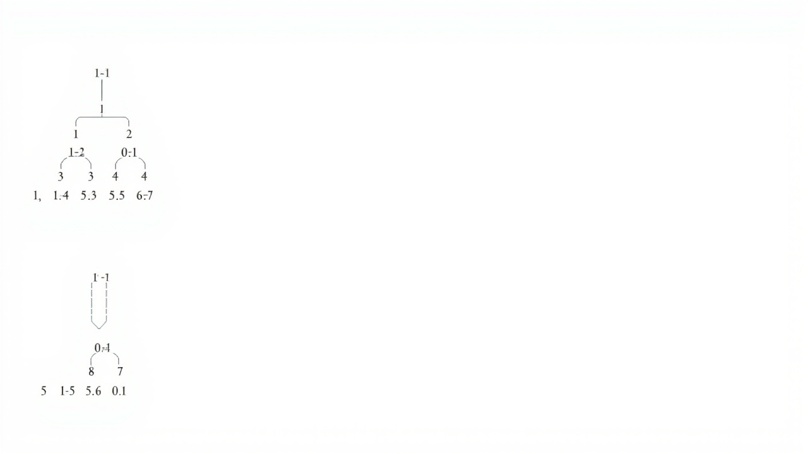

# 二叉树

> _像一棵倒过来的树，每个分叉最多有两个枝丫_

---

## 🎯 先看一个生活中的例子

### 公司组织结构




```
                     CEO（根节点）
                    /           \
              CTO              CFO（内部节点）
             /    \            /    \
        前端    后端       财务   HR
       （叶子） （叶子）  （叶子） （叶子）
```

- CEO 下面是 CTO 和 CFO
- CTO 下面又有前端和后端
- 层层往下，分叉最多两个

---

## 📐 二叉树的基本概念

### 节点结构

```
        ┌──────────────┐
        │     节点      │
        ├──────────────┤
        │     data     │  ← 存储的数据
        ├──────────────┤
        │    left      │──→ 左孩子（可以是 None）
        ├──────────────┤
        │    right     │──→ 右孩子（可以是 None）
        └──────────────┘
```

### 二叉树的分类

```
1. 满二叉树（Full Binary Tree）
   所有节点都有两个子节点（或没有子节点）

        ○
       / \
      ○   ○
     / \ / \
    ○   ○ ○   ○

2. 完全二叉树（Complete Binary Tree）
   除最后一层外，每层节点都满，最后一层从左到右排列

        ○
       / \
      ○   ○
     / \  /
    ○   ○ ○

3. 平衡二叉树（AVL）
   左右子树高度差不超过 1

4. 二叉搜索树（BST）
   左子树所有节点 < 根 < 右子树所有节点
```

---

## 💻 二叉树的代码实现

### 节点类

```python
class TreeNode:
    """二叉树节点"""
    def __init__(self, val):
        self.val = val
        self.left = None   # 左孩子
        self.right = None  # 右孩子

    def __repr__(self):
        return f"TreeNode({self.val})"
```

### 二叉搜索树（BST）

```python
class BST:
    """二叉搜索树"""
    def __init__(self):
        self.root = None

    # ============ 插入 ============
    def insert(self, val):
        """插入节点 O(log n) ~ O(n)"""
        if self.root is None:
            self.root = TreeNode(val)
        else:
            self._insert_recursive(self.root, val)

    def _insert_recursive(self, node, val):
        if val < node.val:
            if node.left is None:
                node.left = TreeNode(val)
            else:
                self._insert_recursive(node.left, val)
        else:
            if node.right is None:
                node.right = TreeNode(val)
            else:
                self._insert_recursive(node.right, val)

    # ============ 查找 ============
    def search(self, val):
        """查找节点 O(log n) ~ O(n)"""
        return self._search_recursive(self.root, val)

    def _search_recursive(self, node, val):
        if node is None or node.val == val:
            return node
        if val < node.val:
            return self._search_recursive(node.left, val)
        return self._search_recursive(node.right, val)

    # ============ 删除 ============
    def delete(self, val):
        """删除节点"""
        self.root = self._delete_recursive(self.root, val)

    def _delete_recursive(self, node, val):
        if node is None:
            return None

        if val < node.val:
            node.left = self._delete_recursive(node.left, val)
        elif val > node.val:
            node.right = self._delete_recursive(node.right, val)
        else:
            # 找到了要删除的节点
            if node.left is None:
                return node.right
            if node.right is None:
                return node.left

            # 有两个子节点，找后继（最小右子树节点）
            successor = self._find_min(node.right)
            node.val = successor.val
            node.right = self._delete_recursive(node.right, successor.val)

        return node

    def _find_min(self, node):
        """找最小节点"""
        while node.left:
            node = node.left
        return node
```

---

## 📐 二叉树的遍历

### 四种遍历方式图解

```
二叉树：

           1
         /   \
        2     3
       / \   /
      4   5 6
```

### 1. 前序遍历（Preorder）：根 → 左 → 右

```
顺序：1 → 2 → 4 → 5 → 3 → 6

记忆：根在前

代码：
def preorder(node):
    if node:
        print(node.val)   # 访问根
        preorder(node.left)   # 遍历左子树
        preorder(node.right)  # 遍历右子树
```

### 2. 中序遍历（Inorder）：左 → 根 → 右

```
顺序：4 → 2 → 5 → 1 → 6 → 3

记忆：BST 中序遍历得到**升序排列**！

代码：
def inorder(node):
    if node:
        inorder(node.left)    # 遍历左子树
        print(node.val)       # 访问根
        inorder(node.right)   # 遍历右子树
```

### 3. 后序遍历（Postorder）：左 → 右 → 根

```
顺序：4 → 5 → 2 → 6 → 3 → 1

记忆：根在后（清理场景，先删子节点再删父节点）

代码：
def postorder(node):
    if node:
        postorder(node.left)   # 遍历左子树
        postorder(node.right)  # 遍历右子树
        print(node.val)        # 访问根
```

### 4. 层序遍历（Level Order）：按层从左到右

```
顺序：1 → 2 → 3 → 4 → 5 → 6

使用队列实现

代码：
from collections import deque

def level_order(root):
    if root is None:
        return []

    queue = deque([root])
    result = []

    while queue:
        node = queue.popleft()
        result.append(node.val)

        if node.left:
            queue.append(node.left)
        if node.right:
            queue.append(node.right)

    return result
```

### 遍历代码汇总

```python
class BinaryTree:
    def __init__(self, root=None):
        self.root = root

    # 前序遍历
    def preorder(self):
        result = []
        self._preorder_recursive(self.root, result)
        return result

    def _preorder_recursive(self, node, result):
        if node:
            result.append(node.val)
            self._preorder_recursive(node.left, result)
            self._preorder_recursive(node.right, result)

    # 中序遍历
    def inorder(self):
        result = []
        self._inorder_recursive(self.root, result)
        return result

    def _inorder_recursive(self, node, result):
        if node:
            self._inorder_recursive(node.left, result)
            result.append(node.val)
            self._inorder_recursive(node.right, result)

    # 后序遍历
    def postorder(self):
        result = []
        self._postorder_recursive(self.root, result)
        return result

    def _postorder_recursive(self, node, result):
        if node:
            self._postorder_recursive(node.left, result)
            self._postorder_recursive(node.right, result)
            result.append(node.val)

    # 层序遍历
    def level_order(self):
        if self.root is None:
            return []

        from collections import deque
        queue = deque([self.root])
        result = []

        while queue:
            node = queue.popleft()
            result.append(node.val)
            if node.left:
                queue.append(node.left)
            if node.right:
                queue.append(node.right)

        return result


# 构建二叉树
#       1
#      / \
#     2   3
#    / \  /
#   4   5 6

root = TreeNode(1)
root.left = TreeNode(2)
root.right = TreeNode(3)
root.left.left = TreeNode(4)
root.left.right = TreeNode(5)
root.right.left = TreeNode(6)

bt = BinaryTree(root)

print("前序遍历:", bt.preorder())    # [1, 2, 4, 5, 3, 6]
print("中序遍历:", bt.inorder())     # [4, 2, 5, 1, 6, 3]
print("后序遍历:", bt.postorder())   # [4, 5, 2, 6, 3, 1]
print("层序遍历:", bt.level_order()) # [1, 2, 3, 4, 5, 6]
```

---

## 📐 二叉树的重要性质

### 性质1：第 i 层最多有 2^(i-1) 个节点

```
第1层：2^0 = 1 个节点
第2层：2^1 = 2 个节点
第3层：2^2 = 4 个节点
...
```

### 性质2：深度为 k 的二叉树最多有 2^k - 1 个节点

```
深度为3的满二叉树：
        ○          第1层：1个
       / \
      ○   ○        第2层：2个
     / \ / \
    ○   ○ ○   ○    第3层：4个
总共：1 + 2 + 4 = 7 = 2^3 - 1
```

### 性质3：叶节点数 = 度为2的节点数 + 1

```
叶节点：没有子节点的节点（度为0）
度为2的节点：有两个子节点的节点

n0 = n2 + 1

验证：
      ○
     / \
    ○   ○
   /
  ○

叶节点(n0) = 2, 度为2的节点(n2) = 1
n0 = n2 + 1 ✓
```

---

## 📐 二叉搜索树（BST）的应用

### BST 中查找第 K 小的元素

```python
def kth_smallest(root, k):
    """BST 中第 K 小的元素"""
    result = []
    inorder BST = 升序排列
    return inorder(root, result)[k-1]

def inorder(node, result):
    if node:
        inorder(node.left, result)
        result.append(node.val)
        inorder(node.right, result)
    return result
```

### BST 验证

```python
def is_valid_bst(root):
    """验证是否为有效的 BST"""
    def validate(node, low, high):
        if node is None:
            return True

        if node.val <= low or node.val >= high:
            return False

        return (validate(node.left, low, node.val) and
                validate(node.right, node.val, high))

    return validate(root, float('-inf'), float('inf'))
```

---

## 🧪 经典面试题

### 题目1：求二叉树深度

```python
def max_depth(root):
    """求二叉树的最大深度"""
    if root is None:
        return 0

    left_depth = max_depth(root.left)
    right_depth = max_depth(root.right)

    return max(left_depth, right_depth) + 1


#       3
#      / \
#     9   20
#        /  \
#       15   7
# 结果：3
```

### 题目2：判断是否为平衡二叉树

```python
def is_balanced(root):
    """判断是否为平衡二叉树（AVL）"""
    def check(node):
        if node is None:
            return 0

        left = check(node.left)
        if left == -1:
            return -1

        right = check(node.right)
        if right == -1:
            return -1

        if abs(left - right) > 1:
            return -1

        return max(left, right) + 1

    return check(root) != -1
```

### 题目3：求二叉树路径和等于 target

```python
def has_path_sum(root, target):
    """是否存在从根到叶子的路径，和等于 target"""
    if root is None:
        return False

    if root.left is None and root.right is None:
        return root.val == target

    return (has_path_sum(root.left, target - root.val) or
            has_path_sum(root.right, target - root.val))
```

### 题目4：翻转二叉树

```python
def invert_tree(root):
    """翻转二叉树"""
    if root is None:
        return None

    root.left, root.right = root.right, root.left

    invert_tree(root.left)
    invert_tree(root.right)

    return root


#       1              1
#      / \    →       / \
#     2   3          3   2
#                        / \
#                       4   5
```

---

## ✅ 本章小结

| 遍历方式 | 顺序 | 应用场景 |
|---------|------|---------|
| 前序 | 根 → 左 → 右 | 创建/复制树 |
| 中序 | 左 → 根 → 右 | BST 升序排列 |
| 后序 | 左 → 右 → 根 | 删除/释放树 |
| 层序 | 按层 | 最短路径、层级关系 |

| 二叉树类型 | 特点 |
|-----------|------|
| 满二叉树 | 每节点都有两个或零个子节点 |
| 完全二叉树 | 除最后一层都满，最后层从左排 |
| BST | 左 < 根 < 右 |
| 平衡二叉树 | 左右子树高度差 ≤ 1 |

---

## 🔗 继续学习

👉 [堆](./堆.md)
