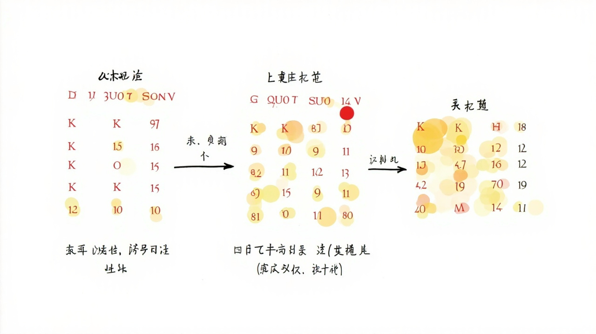

# Attention注意力机制

> _让神经网络学会"关注"重点的革命性技术_

---

## 🎯 先看一个生活中的例子

### 例子：翻译员的笔记




假设你是一个中英翻译员，要翻译这句话：

```
中文："今天天气很好，我们去公园吧"
```

你会怎么做？

1. 你听到"今天天气很好" → 脑子里想：这是在描述天气，后面可能要建议户外活动
2. 你听到"我们去公园吧" → 确认了：确实是在建议去公园，因为天气好

**关键：你不是平等地听每一个词，而是"关注"相关的词！**

这就是 **Attention（注意力机制）** 的核心思想！

---

## 🤔 Seq2Seq 模型的问题

### Encoder-Decoder 架构

```
Seq2Seq（序列到序列）：
编码器：处理整个输入序列 → 压缩成上下文向量
解码器：从上下文向量生成输出序列

翻译例子：
"今天天气很好" → [上下文向量] → "Today weather is good"
```

### 信息瓶颈问题

```
问题：上下文向量是固定长度的！

无论输入多长（比如10个词或100个词），
都压缩成一个向量（可能只有256维或512维）！

信息瓶颈：
- 短的句子：压缩轻松 ✓
- 长的句子：信息量巨大，被压缩后可能丢失关键信息 ✗
```

---

## 🌟 Attention 的核心思想

### 解决之道：动态关注

```
不要只用一个固定的上下文向量！
让解码器在生成每个词时，动态地"关注"输入的不同部分！

翻译过程：

生成第1个词 "Today"：
  - 关注"今天"
  - 关注度：[0.9, 0.1, 0.0, 0.0, 0.0]
  
生成第2个词 "weather"：
  - 关注"天气"
  - 关注度：[0.0, 0.8, 0.2, 0.0, 0.0]
  
生成第3个词 "is"：
  - 关注"很"
  - 关注度：[0.0, 0.2, 0.7, 0.1, 0.0]
```

### Attention 图示

```
                    解码器
                       ↑
                       │ 上下文向量（动态加权）
                       │
┌──────────────────────┼──────────────────────┐
│                      │                      │
│  "今天" ──高权重────┼───────低权重──────────│
│  "天气" ────────────┼────────────高权重─────│
│  "很"  ─────────────┼──────────────────────│
│  "好"  ─────────────┼──────────────────────│
│  "，"  ─────────────┼──────────────────────│
└──────────────────────┴──────────────────────┘
         ↑                       ↑
       输入序列               注意力权重
```

---

## 📐 Query-Key-Value：Attention的数学

### 图书馆的比喻

```
Query（查询）："我想找一本关于机器学习的书"
              ↓
  你在找什么？→ 你的问题/需求

Key（键）：每个书架上的标签
          "机器学习" "深度学习" "Python编程"
          ↓
  标签匹配度？→ 我有什么

Value（值）：书架上书的实际内容
            ↓
  匹配后要获取的信息

Attention = 根据 Query 找到最相关的 Key，取出对应的 Value
```

### Attention 的公式

```
Attention(Q, K, V) = softmax(QK^T / √d_k) × V

1. QK^T：计算 Query 和每个 Key 的相似度
2. / √d_k：缩放，防止点积过大
3. softmax：归一化，得到注意力权重
4. × V：加权求和，得到最终输出
```

---

## 💻 代码实现

### Attention 代码

```python
import numpy as np

def attention(Q, K, V):
    """
    缩放点积注意力

    参数:
        Q: 查询矩阵 (seq_len, d_k)
        K: 键矩阵 (seq_len, d_k)
        V: 值矩阵 (seq_len, d_v)
    返回:
        输出矩阵 (seq_len, d_v)
        注意力权重 (seq_len, seq_len)
    """
    d_k = K.shape[-1]

    # 1. 计算 Q 和 K 的点积
    scores = np.dot(Q, K.T) / np.sqrt(d_k)

    # 2. softmax 归一化，得到注意力权重
    exp_scores = np.exp(scores - np.max(scores, axis=-1, keepdims=True))
    attention_weights = exp_scores / np.sum(exp_scores, axis=-1, keepdims=True)

    # 3. 加权求和
    output = np.dot(attention_weights, V)

    return output, attention_weights


# 测试
np.random.seed(42)

# 假设序列长度是 5，每个词的向量维度是 8
seq_len = 5
d = 8

Q = np.random.randn(seq_len, d)  # 查询
K = np.random.randn(seq_len, d)  # 键
V = np.random.randn(seq_len, d)  # 值

output, weights = attention(Q, K, V)

print(f"输出形状: {output.shape}")       # (5, 8)
print(f"注意力权重形状: {weights.shape}")  # (5, 5)

print("\n注意力权重矩阵（第一行=第一个词对所有词的注意力）:")
print(weights[0].round(3))
```

---

## 🌟 多头注意力（Multi-Head Attention）

### 为什么需要多头？

```
一个注意力头只能学习一种"相关性"模式

多个注意力头可以从不同角度学习相关性：
- 头1：关注语法关系（主语-动词）
- 头2：关注语义关系（同义词）
- 头3：关注位置关系（相邻词）
- 头4：关注指代关系（它/他指代什么）
```

### 多头注意力的结构

```
输入 X ──┬──→ Q₁, K₁, V₁ ──→ Head₁ ──┐
         ├──→ Q₂, K₂, V₂ ──→ Head₂ ──┼──→ Concat ──→ Linear ──→ 输出
         ├──→ Q₃, K₃, V₃ ──→ Head₃ ──┤
         └──→ Q₄, K₄, V₄ ──→ Head₄ ──┘

每个头独立计算注意力，最后拼接
```

---

## 💻 多头注意力代码

```python
class MultiHeadAttention:
    """多头注意力"""
    def __init__(self, d_model, num_heads):
        assert d_model % num_heads == 0

        self.d_model = d_model
        self.num_heads = num_heads
        self.d_k = d_model // num_heads

        # 初始化 Q, K, V 的投影矩阵
        self.W_q = np.random.randn(d_model, d_model) * 0.1
        self.W_k = np.random.randn(d_model, d_model) * 0.1
        self.W_v = np.random.randn(d_model, d_model) * 0.1
        self.W_o = np.random.randn(d_model, d_model) * 0.1

    def split_heads(self, X, batch_size):
        """把 d_model 维分成 num_heads 个 d_k 维"""
        X = X.reshape(batch_size, -1, self.num_heads, self.d_k)
        return X.transpose(0, 2, 1, 3)  # (batch, heads, seq, d_k)

    def forward(self, Q, K, V, mask=None):
        batch_size = Q.shape[0]

        # 1. 线性投影
        Q = np.dot(Q, self.W_q)
        K = np.dot(K, self.W_k)
        V = np.dot(V, self.W_v)

        # 2. 分成多头
        Q = self.split_heads(Q, batch_size)
        K = self.split_heads(K, batch_size)
        V = self.split_heads(V, batch_size)

        # 3. 计算注意力
        d_k = Q.shape[-1]
        scores = np.dot(Q, K.transpose(0, 1, 3, 2)) / np.sqrt(d_k)

        if mask is not None:
            scores = scores + mask

        attention_weights = self.softmax(scores)
        attention_output = np.dot(attention_weights, V)

        # 4. 合并多头
        attention_output = attention_output.transpose(0, 2, 1, 3).reshape(batch_size, -1, self.d_model)

        # 5. 最终线性投影
        output = np.dot(attention_output, self.W_o)

        return output, attention_weights

    def softmax(self, x):
        exp_x = np.exp(x - np.max(x, axis=-1, keepdims=True))
        return exp_x / np.sum(exp_x, axis=-1, keepdims=True)
```

---

## 🔄 Self-Attention vs Cross-Attention

### Self-Attention（自注意力）

```
Query, Key, Value 都来自同一个输入

例子：分析"今天天气很好"
- "今天"的 Query 查找和所有词的关系
- 每个词都在"关注"其他词

应用：Transformer 的 Encoder
```

### Cross-Attention（交叉注意力）

```
Query 来自 Decoder，Key/Value 来自 Encoder

例子：翻译
- Decoder 的 Query 查找 Encoder 的 Key/Value
- 问："现在应该生成什么词？"（Query）
- 查找："编码器看到了什么？"（Key/Value）

应用：Transformer 的 Decoder
```

---

## 📊 Attention 在实际中的应用

### 应用1：机器翻译

```
英文 "The cat sat on the mat" → 中文 "猫坐在垫子上"

生成每个中文词时，动态关注不同的英文词：
- 生成"猫" → 高度关注 "cat"
- 生成"坐在" → 高度关注 "sat on"
- 生成"垫子上" → 高度关注 "mat"
```

### 应用2：文本摘要

```
输入：一篇长文章
输出：摘要

生成摘要的每个词时，关注文章的不同部分：
- "本文" → 关注开头
- "报道" → 关注中间
- "指出" → 关注结尾（通常结论在结尾）
```

### 应用3：图像描述

```
输入：一张图片
输出：一段描述

生成描述的每个词时，关注图片的不同区域：
- 生成"猫" → 关注图片中猫的位置
- 生成"坐在" → 关注猫和什么东西的关系
```

---

## ✅ 本章小结

| 概念 | 解释 |
|------|------|
| Attention | 动态选择需要关注的信息 |
| Query-Key-Value | 查询、键、值三元组 |
| QK^T | 计算 Query 和 Key 的相似度 |
| softmax | 归一化，得到注意力权重 |
| 多头注意力 | 从多个角度学习不同的相关性 |
| Self-Attention | Q,K,V 来自同一输入 |
| Cross-Attention | Q 来自 Decoder，K,V 来自 Encoder |

---

## 🔗 继续学习

Attention 是 Transformer 的核心！下一章我们将学习 Transformer 的完整结构。

👉 [Transformer](./Transformer.md)
