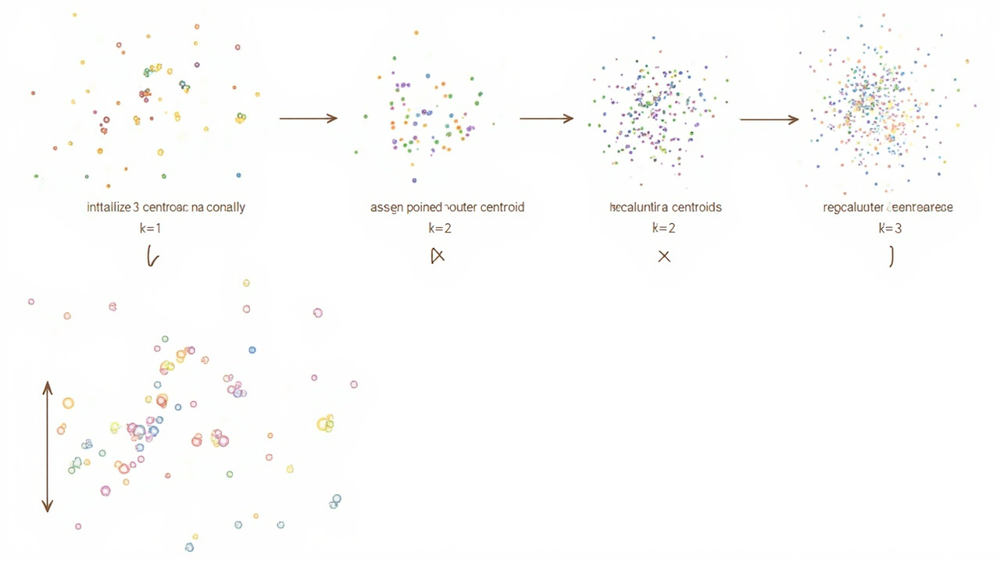

# K-Means聚类

> _物以类聚，人以群分——让相似的数据自动聚在一起_

---

## 🎯 先看一个生活中的例子

### 例子：超市顾客分群




假设你是一家超市的市场经理，想把顾客分成几类，然后针对每类做不同的营销策略。

你有哪些顾客数据？
- 每月消费金额
- 每月购物次数
- 逛超市的平均时长

### 如果让你手动分群

```
高消费、高频次、长时长 → "VIP忠实顾客"  ← 给优惠，保持忠诚度
低消费、低频次、短时长 → "偶尔逛逛"     ← 发促销短信吸引
高消费、低频次、短时长 → "有钱没时间"   ← 推线上购物
...
```

这就是**聚类**的思想：**根据数据的相似程度，自动把数据分成若干组。**

---

## 🤔 什么是聚类？

### 有监督 vs 无监督学习

```
有监督学习：有标签，知道正确答案
  例如：肿瘤分类（良性/恶性），有明确的标签

无监督学习：没有标签，不知道正确答案
  例如：把顾客分成几类，事先不知道应该分几类

聚类是无监督学习的核心任务之一！
```

### 聚类的目标

**让同一组（簇）的数据尽可能相似，让不同组的数据尽可能不同。**

```
┌─────────────────────────────┐
│   簇 A：紧密聚集在一起      │
│   ● ● ●                     │
│     ● ●                     │
│                             │
│   簇 B：紧密聚集在一起      │
│      ■ ■ ■                  │
│        ■ ■                  │
│                             │
│   簇 C：紧密聚集在一起      │
│        ▲ ▲ ▲ ▲              │
└─────────────────────────────┘
```

---

## 🎯 K-Means 核心思想

### K-Means 的 K 是什么意思？

**K = 要分成几个簇（类别）**

```
K=2：分成 2 组
K=3：分成 3 组
K=4：分成 4 组
...
```

### K-Means 的两大步骤

**Step 1：分配（Assignment）**
每个数据点归到离它最近的中心点（质心）所属的簇

**Step 2：更新（Update）**
重新计算每个簇的中心点（质心）

**重复 Step 1 和 Step 2，直到中心点不再变化（或变化很小）**

---

## 📐 K-Means 算法详解

### 步骤图解

```
原始数据点：                          K = 2（假设）
    ●
       ●  ●                              ① ①
          ●  ●                         ② ②
    ●        ●                       ② ② ① ①
       ●  ●                         ① ①
    ●                                ② ②
       ●  ●                          ① ① ② ②
```

**第一轮：**

```
Step 1 - 分配：                       Step 2 - 更新：
随机选2个中心点                       重新计算中心点
（红色×和蓝色×）                      （移到各自簇的中心）
    ●                                  ●        ●
   ×  ●  ●                            ●  ×    ×  ●
      ●  ●         →                      ●  ●
    ●     ×                            ×    ●
       ●  ●                             ●  ●
    ●        ×                          ●
```

**第二轮：**

```
Step 1 - 分配：                       Step 2 - 更新：
重新分配到最近的中心                   再次更新中心
    ●      ●                             ●    ●
   ●    ●     ●                          ●    ●
      ●       ×                         ● ×  ×
    ×    ●     ●                      ×   ●  ●
```

**直到收敛...**

---

## 📐 数学公式

### 目标函数：最小化簇内误差平方和

```
J = Σᵢ Σⱼ ||xⱼ⁽ⁱ⁾ - μᵢ||²

其中：
- K 是簇的数量
- xⱼ⁽ⁱ⁾ 是第 i 个簇中的第 j 个数据点
- μᵢ 是第 i 个簇的中心点
- ||x - μ|| 是欧氏距离
```

**目标：找到 K 个中心点 μ₁, μ₂, ..., μₖ，使得 J 最小！**

### 具体步骤

```
输入：K（簇数量），数据集 X = {x₁, x₂, ..., xₙ}

1. 随机初始化 K 个中心点 μ₁, μ₂, ..., μₖ

2. 重复直到收敛：
   a. 分配步骤：
      对每个数据点 xᵢ：
        找到最近的中心点 μₖ
        把 xᵢ 分配给簇 k*

   b. 更新步骤：
      对每个簇 k：
        重新计算中心点 μₖ = 该簇所有点的平均值
```

---

## 💻 代码实现

### 核心实现

```python
import numpy as np
import matplotlib.pyplot as plt

class KMeans:
    """K-Means 聚类算法"""

    def __init__(self, n_clusters=3, max_iters=100, random_state=42):
        self.n_clusters = n_clusters
        self.max_iters = max_iters
        self.random_state = random_state
        self.centroids = None  # 中心点
        self.labels = None     # 每个样本的簇标签

    def fit(self, X):
        """
        训练 K-Means

        参数:
            X: 数据矩阵 (n_samples, n_features)
        """
        np.random.seed(self.random_state)

        n_samples = len(X)

        # ===== 第1步：随机初始化 K 个中心点 =====
        # 方法：从数据中随机选 K 个样本作为初始中心
        indices = np.random.choice(n_samples, self.n_clusters, replace=False)
        self.centroids = X[indices].copy()

        print("=== K-Means 训练开始 ===")
        print(f"初始中心点: \n{self.centroids}\n")

        # ===== 第2步：迭代优化 =====
        for iteration in range(self.max_iters):
            # 保存旧的中心点，用于判断收敛
            old_centroids = self.centroids.copy()

            # ===== Step 1: 分配每个点到最近的中心 =====
            self.labels = self._assign_clusters(X)
            print(f"第 {iteration+1} 轮分配后的簇标签: {np.bincount(self.labels)}")

            # ===== Step 2: 更新中心点 =====
            self.centroids = self._update_centroids(X)

            # ===== 检查收敛 =====
            # 如果中心点不再变化（或变化很小），停止
            shift = np.sum(np.sqrt(np.sum((self.centroids - old_centroids)**2, axis=1)))
            print(f"第 {iteration+1} 轮: 中心点移动距离 = {shift:.4f}\n")

            if shift < 1e-6:
                print(f"=== 收敛！共迭代 {iteration+1} 轮 ===")
                break

        return self

    def _assign_clusters(self, X):
        """把每个点分配到最近的中心"""
        n_samples = len(X)
        labels = np.zeros(n_samples, dtype=int)

        for i in range(n_samples):
            # 计算到每个中心的距离
            distances = np.sqrt(np.sum((X[i] - self.centroids)**2, axis=1))
            # 选择最近的中心
            labels[i] = np.argmin(distances)

        return labels

    def _update_centroids(self, X):
        """更新中心点为该簇所有点的均值"""
        new_centroids = np.zeros_like(self.centroids)

        for k in range(self.n_clusters):
            # 找到属于簇 k 的所有点
            cluster_points = X[self.labels == k]

            if len(cluster_points) > 0:
                # 簇非空，计算均值作为新中心
                new_centroids[k] = cluster_points.mean(axis=0)
            else:
                # 簇为空，随机选一个点作为新中心
                new_centroids[k] = X[np.random.randint(len(X))]

        return new_centroids

    def predict(self, X):
        """预测新数据的簇标签"""
        return self._assign_clusters(X)

    def fit_predict(self, X):
        """训练并预测"""
        self.fit(X)
        return self.labels
```

---

## 🧪 完整例子

### 例子1：简单的二维数据

```python
# 生成示例数据
np.random.seed(42)

# 簇1：中心在 (2, 2)，30个点
cluster1 = np.random.randn(30, 2) + np.array([2, 2])

# 簇2：中心在 (-2, -1)，30个点
cluster2 = np.random.randn(30, 2) + np.array([-2, -1])

# 簇3：中心在 (1, -3)，30个点
cluster3 = np.random.randn(30, 2) + np.array([1, -3])

# 合并数据
X = np.vstack([cluster1, cluster2, cluster3])
np.random.shuffle(X)

print(f"数据形状: {X.shape}")
print(f"前5个数据点:\n{X[:5]}")

# 训练 K-Means，K=3
kmeans = KMeans(n_clusters=3, max_iters=100, random_state=42)
labels = kmeans.fit_predict(X)

print(f"\n最终中心点:\n{kmeans.centroids}")
print(f"每个簇的样本数: {np.bincount(labels)}")
```

### 例子2：客户分群

```python
# 模拟客户数据
# 特征1: 月均消费（元）
# 特征2: 月均购物次数
# 特征3: 平均每次逛店时长（分钟）

np.random.seed(42)

# VIP 客户：消费高、次数多、时长长
vip = np.random.randn(50, 3) * np.array([500, 2, 10]) + np.array([5000, 15, 45])

# 普通客户：消费中等、次数中等
normal = np.random.randn(80, 3) * np.array([300, 3, 8]) + np.array([1500, 6, 25])

# 年轻随手型：消费低、次数少、时长短
young = np.random.randn(40, 3) * np.array([200, 1, 5]) + np.array([300, 2, 10])

# 合并
customers = np.vstack([vip, normal, young])

# 聚类
kmeans = KMeans(n_clusters=3, random_state=42)
labels = kmeans.fit_predict(customers)

print("=== 客户分群结果 ===")
print(f"簇0（可能是普通客户）: {np.sum(labels == 0)} 人")
print(f"簇1（可能是VIP客户）: {np.sum(labels == 1)} 人")
print(f"簇2（可能是年轻随手型）: {np.sum(labels == 2)} 人")
print(f"\n各簇中心点:")
print(f"簇0中心: 消费={kmeans.centroids[0,0]:.0f}元, 次数={kmeans.centroids[0,1]:.0f}次, 时长={kmeans.centroids[0,2]:.0f}分")
print(f"簇1中心: 消费={kmeans.centroids[1,0]:.0f}元, 次数={kmeans.centroids[1,1]:.0f}次, 时长={kmeans.centroids[1,2]:.0f}分")
print(f"簇2中心: 消费={kmeans.centroids[2,0]:.0f}元, 次数={kmeans.centroids[2,1]:.0f}次, 时长={kmeans.centroids[2,2]:.0f}分")
```

---

## 🎯 如何选择 K？

### 方法1：肘部法则（Elbow Method）

**核心思想：**
- K 太小 → 每个簇很大，数据点分散
- K 太大 → 簇太小，可能过拟合
- K 合适 → 簇内紧凑，簇间分离

**SSE（Sum of Squared Errors，簇内误差平方和）：**
```
SSE = Σᵢ Σⱼ ||xⱼ⁽ⁱ⁾ - μᵢ||²
```

随着 K 增大，SSE 减小。

**画 SSE-K 曲线，找"肘部"（拐点）！**

```python
def elbow_method(X, max_k=10):
    """
    肘部法则：尝试不同的 K，画 SSE 曲线
    """
    sses = []

    for k in range(1, max_k + 1):
        kmeans = KMeans(n_clusters=k, random_state=42)
        kmeans.fit(X)

        # 计算 SSE
        sse = 0
        for i in range(k):
            cluster_points = X[kmeans.labels == i]
            sse += np.sum((cluster_points - kmeans.centroids[i])**2)
        sses.append(sse)

        print(f"K={k}: SSE={sse:.2f}")

    return sses

# 使用
sses = elbow_method(X, max_k=8)

# 画图
plt.plot(range(1, 9), sses, 'bo-')
plt.xlabel('K (簇数量)')
plt.ylabel('SSE (簇内误差平方和)')
plt.title('肘部法则')
plt.show()

# 观察：在哪个 K 处出现"肘部"？
```

### 肘部法则图示

```
SSE
  │
500│                 ●●●
   │              ●
300│           ●
   │        ●
100│     ●
   │  ●
  0───────────────────→ K
      1  2  3  4  5  6
             ↑
           肘部！
           K=3 是好选择
```

---

## ⚠️ K-Means 的问题

### 问题1：K-Means++ 初始化

**问题：** 随机初始化中心点可能导致结果不稳定

**解决方案：** K-Means++ 初始化方法

```
K-Means++ 初始化步骤：
1. 随机选一个点作为第一个中心点
2. 对每个点，计算到最近中心点的距离 D(x)
3. 选择 D(x)² 最大的点作为下一个中心点（距离越远越可能）
4. 重复 2-3，直到选完 K 个中心点
```

```python
def kmeans_plusplus_init(X, K):
    """K-Means++ 初始化"""
    n = len(X)

    # 1. 随机选第一个中心
    centroids = [X[np.random.randint(n)]]

    # 2. 选剩下的 K-1 个中心
    for _ in range(K - 1):
        # 计算每个点到最近中心的距离
        distances = np.zeros(n)
        for i in range(n):
            min_dist = float('inf')
            for c in centroids:
                d = np.sqrt(np.sum((X[i] - c)**2))
                min_dist = min(min_dist, d)
            distances[i] = min_dist

        # 选距离平方最大的点
        next_centroid_idx = np.argmax(distances**2)
        centroids.append(X[next_centroid_idx])

    return np.array(centroids)
```

### 问题2：受离群点影响

**问题：** 离群点会拉偏中心点

**解决方案：**
- K-Medoids：用中位数代替均值
- 预处理去掉离群点

### 问题3：假设簇是球形、大小相近

**问题：** K-Means 假设簇是圆形的、大小差不多

```
K-Means 能处理：
  ● ● ●
  ● ● ●     圆形簇

K-Means 难以处理：
    ●
   ● ●       大小差异大的簇
  ●    ●

或者：
  ● ● ●     形状不规则的簇
    ● ●
  ● ●
```

---

## 📊 sklearn 实现

```python
from sklearn.cluster import KMeans
from sklearn.datasets import make_blobs
import matplotlib.pyplot as plt

# 生成数据
X, _ = make_blobs(n_samples=300, centers=3, cluster_std=1.0, random_state=42)

# 训练 K-Means
kmeans = KMeans(n_clusters=3, init='k-means++', n_init=10, random_state=42)
kmeans.fit(X)

# 预测
labels = kmeans.predict(X)

# 画图
plt.scatter(X[:, 0], X[:, 1], c=labels, cmap='viridis')
plt.scatter(kmeans.cluster_centers_[:, 0], kmeans.cluster_centers_[:, 1],
            c='red', marker='x', s=200, linewidths=3, label='中心点')
plt.legend()
plt.title('K-Means 聚类结果')
plt.show()

# 肘部法则
from sklearn.metrics import silhouette_score

silhouette_scores = []
for k in range(2, 8):
    km = KMeans(n_clusters=k, random_state=42)
    labels = km.fit_predict(X)
    score = silhouette_score(X, labels)
    silhouette_scores.append(score)
    print(f"K={k}: 轮廓系数={score:.4f}")

# 轮廓系数越接近 1 越好
```

---

## ✅ 本章小结

| 概念 | 解释 |
|------|------|
| 聚类 | 无监督学习，把相似的数据点分到同一组 |
| K-Means | 最常用的聚类算法之一 |
| 中心点（质心）| 簇内所有点的均值 |
| SSE | 簇内误差平方和，衡量聚类质量 |
| 肘部法则 | 用 SSE-K 曲线找最优 K |
| K-Means++ | 改进的初始化方法，更稳定 |

---

## 🔗 继续学习

👉 [梯度下降](./梯度下降.md)
