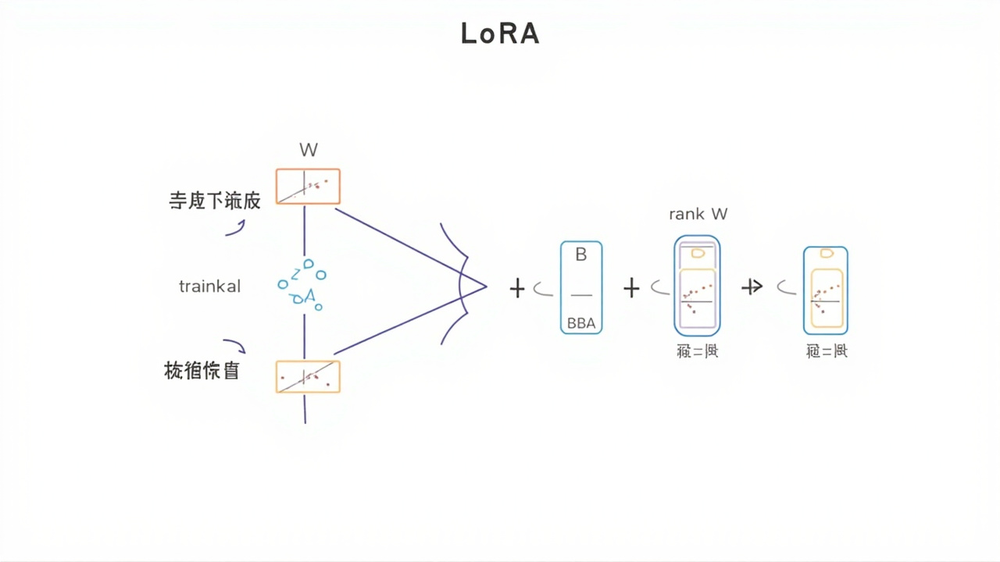

# LoRA

> _高效微调大模型的秘诀，让每个人都能够定制自己的AI_

---

## 🎯 先看一个生活中的例子

### 例子：装修房子




假设你买了一栋毛坯房：

```
全量装修：
- 拆掉所有墙
- 重新规划每个房间
- 更换所有管道和电线
- 耗时 3 个月，花费 50 万

LoRA 装修：
- 保留毛坯房的主体结构
- 只装修几个关键房间（客厅、卧室）
- 换上自己喜欢的家具和装饰
- 耗时 1 周，花费 3 万

LoRA = Low-Rank Adaptation = 低秩适配
在 AI 中就是：冻结大部分参数，只微调一小部分！
```

---

## 🤔 为什么需要 LoRA？

### 大模型的参数问题

```
GPT-2:     15 亿参数
GPT-3:    1750 亿参数
GPT-4:    ~1 万亿参数
LLaMA-7B:  70 亿参数
LLaMA-70B: 700 亿参数

全量微调的问题：
- 需要更新所有参数
- 需要巨大的 GPU 显存
- 70B 模型全量微调需要 ~1400GB 显存！
- 普通玩家根本玩不起！
```

### LoRA 的灵感

```
问题：真的需要更新所有参数吗？

观察：
- 大模型的参数虽然多，但有效自由度可能没那么高
- 就像装修房子，不需要改变结构，只需要改变装修

LoRA 核心思想：
- 冻结原始模型参数
- 只训练一小部分新增参数
- 达到全量微调的效果，但只训练 0.1% 的参数！
```

---

## 📐 LoRA 的数学原理

### 低秩分解

```
原始权重矩阵：W₀ ∈ R^(d × k)

LoRA 添加：ΔW = BA
- B ∈ R^(d × r)
- A ∈ R^(r × k)
- r << min(d, k)，r 是低秩

更新后：W = W₀ + ΔW = W₀ + BA
```

### 参数对比

```
例子：
- d = 4096
- k = 4096
- r = 8

原始全量参数：4096 × 4096 = 16,777,216 ≈ 1680 万

LoRA 新增参数：(4096 + 4096) × 8 = 65,536 ≈ 6.5 万

节省：256 倍！！！
```

### 直观理解

```
原始 W：              分解后的 BA：
4096 × 4096          4096 × 8    ×    8 × 4096
                     ↓
                 中间只有 8 维！
                 这 8 维可能就足够了
```

---

## 💻 代码实现

### LoRA 层实现

```python
import torch
import torch.nn as nn

class LoRALinear(nn.Module):
    """LoRA 线性层"""
    def __init__(self, in_features, out_features, rank=4, alpha=1.0):
        super().__init__()

        # 冻结原始权重
        self.weight = nn.Parameter(
            torch.randn(out_features, in_features),
            requires_grad=False
        )

        # LoRA 的 A 和 B 矩阵（可训练）
        self.lora_A = nn.Parameter(torch.randn(rank, in_features) * 0.01)
        self.lora_B = nn.Parameter(torch.zeros(out_features, rank))

        # 缩放因子
        self.scaling = alpha / rank

        # 不需要 bias（保持和原始层一致）
        self.bias = None

    def forward(self, x):
        """
        前向传播
        """
        # 原始输出
        original = nn.functional.linear(x, self.weight, self.bias)

        # LoRA 输出（低秩更新）
        # x @ A^T @ B^T = x @ A.T @ B.T
        lora = (x @ self.lora_A.T @ self.lora_B.T) * self.scaling

        return original + lora
```

### 在模型中应用 LoRA

```python
def replace_linear_with_lora(model, target_module_type, rank=4, alpha=1.0):
    """
    把模型中的 Linear 层替换成 LoRA 版本
    """
    for name, module in model.named_children():
        if isinstance(module, target_module_type):
            # 检查是否是可以应用 LoRA 的层
            if module.in_features > 0 and module.out_features > 0:
                # 创建 LoRA 版本
                lora_layer = LoRALinear(
                    module.in_features,
                    module.out_features,
                    rank=rank,
                    alpha=alpha
                )
                # 复制原始权重（冻结）
                lora_layer.weight.data = module.weight.data.clone()
                # 替换
                setattr(model, name, lora_layer)
        else:
            # 递归处理子模块
            replace_linear_with_lora(module, target_module_type, rank, alpha)
```

---

## 🧪 完整例子：用 LoRA 微调 LLaMA

### 安装 PEFT 库

```bash
pip install peft transformers accelerate datasets
```

### 完整代码

```python
from transformers import AutoModelForCausalLM, AutoTokenizer, TrainingArguments, Trainer
from peft import LoraConfig, get_peft_model, TaskType
import datasets

# 1. 加载预训练模型
model_name = "bigscience/bloom-560m"  # 560M 参数的小模型
tokenizer = AutoTokenizer.from_pretrained(model_name)
model = AutoModelForCausalLM.from_pretrained(model_name)

# 2. 配置 LoRA
lora_config = LoraConfig(
    task_type=TaskType.CAUSAL_LM,  # 因果语言模型
    r=8,                             # 低秩 rank
    lora_alpha=16,                   # 缩放因子
    lora_dropout=0.05,              # Dropout
    target_modules=["query_key_value"]  # 应用到哪些层
)

# 3. 应用 LoRA
model = get_peft_model(model, lora_config)

# 4. 查看可训练参数
model.print_trainable_parameters()
# 输出：trainable params: 4,194,304 || all params: 560,703,488 || trainable%: 0.748

# 5. 准备数据
def tokenize_function(examples):
    return tokenizer(examples["text"], truncation=True, padding="max_length", max_length=128)

dataset = datasets.load_dataset("your_dataset")
tokenized_dataset = dataset.map(tokenize_function, batched=True)

# 6. 训练
training_args = TrainingArguments(
    output_dir="./lora_model",
    num_train_epochs=3,
    per_device_train_batch_size=4,
    learning_rate=3e-4,
    logging_steps=10,
    save_strategy="epoch"
)

trainer = Trainer(
    model=model,
    args=training_args,
    train_dataset=tokenized_dataset["train"]
)

trainer.train()

# 7. 保存
model.save_pretrained("./lora_weights")
```

---

## 📊 QLoRA：更高效的版本

### QLoRA 是什么？

```
QLoRA = Quantization + LoRA

结合了：
1. 4-bit 量化：把模型参数压缩到 4 位
2. LoRA：只微调一小部分参数

效果：
- 65B 参数的模型，可以在 48GB 显存的 GPU 上微调！
- 之前需要 ~1300GB，根本不可能
```

### 使用 QLoRA

```python
from transformers import BitsAndBytesConfig
import torch

# 4-bit 量化配置
bnb_config = BitsAndBytesConfig(
    load_in_4bit=True,
    bnb_4bit_use_double_quant=True,
    bnb_4bit_quant_type="nf4",
    bnb_4bit_compute_dtype=torch.float16
)

# 加载量化模型
model = AutoModelForCausalLM.from_pretrained(
    "meta-llama/Llama-2-70b-hf",
    quantization_config=bnb_config,
    device_map="auto"
)

# 应用 LoRA
model = get_peft_model(model, lora_config)
```

---

## 📊 LoRA vs 全量微调 vs Adapter

### 参数对比

| 方法 | 可训练参数 | 显存需求 | 速度 |
|------|-----------|---------|------|
| 全量微调 | 100% | 最高 | 最慢 |
| Adapter | 1-5% | 中等 | 中等 |
| LoRA | 0.1-1% | 最低 | 最快 |

### 效果对比

```
在全量微调和 LoRA 微调的对比实验中：

任务：LLaMA-7B 在多个基准测试上的准确率

全量微调: ████████████████████ 68.2%
LoRA:     ████████████████████ 67.8%

几乎一样！
但 LoRA 只训练了 0.1% 的参数！
```

---

## 🎨 LoRA 的实际应用

### 1. 定制 AI 画风

```
Stable Diffusion + LoRA：
- 下载基础 SD 模型（冻结）
- 准备几张自己想要的画风图片
- 用 LoRA 微调
- 生成指定画风的新图片！

比如：
- 日系插画 LoRA
- 真人照片 LoRA
- 古风 LoRA
- 儿童绘本 LoRA
```

### 2. 定制 AI 聊天机器人

```
LLaMA + LoRA：
- 下载基础 LLaMA 模型（冻结）
- 准备对话数据集
- 用 LoRA 微调
- 获得定制化的聊天机器人！

比如：
- 私人助手 LoRA
- 客服机器人 LoRA
- 心理医生 LoRA
```

### 3. 特定领域的知识注入

```
通用大模型 + LoRA：
- 通用大模型（已经学会了很多知识）
- 专业领域数据集
- 用 LoRA 注入专业知识

比如：
- 医疗助手 LoRA
- 法律顾问 LoRA
- 金融分析 LoRA
```

---

## ✅ 本章小结

| 概念 | 解释 |
|------|------|
| LoRA | 低秩适配，只微调一小部分参数 |
| 低秩分解 | W = W₀ + BA，其中 B 和 A 是低秩矩阵 |
| 重参数化 | 在推理时可以合并回原始权重 |
| QLoRA | 结合 4-bit 量化的 LoRA |
| PEFT | Parameter Efficient Fine-Tuning（高效微调）|
| 目标模块 | 应用 LoRA 的层（如 query_key_value）|

---

## 🔗 继续学习

恭喜你完成了机器学习所有详细教程的学习！

你已经掌握了：
- 传统机器学习：线性回归、逻辑回归、决策树、随机森林、K-Means、梯度下降
- 深度学习：感知机、BP反向传播、CNN、RNN/LSTM、Attention、Transformer
- 生成模型：VAE、GAN、DDPM、Stable Diffusion
- 模型优化：LoRA

这些构成了现代 AI 的基石！

---

_机器学习详细教程全部完成！祝你学习愉快！🎉_
