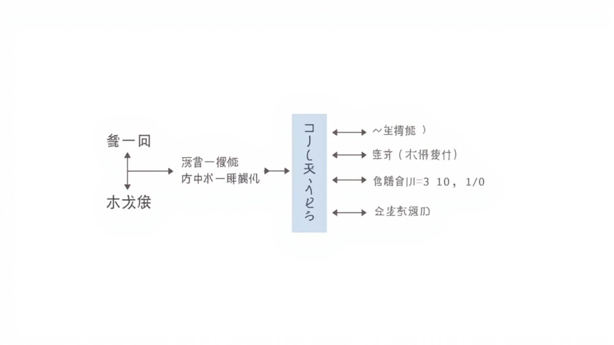

# Transformer

> _完全基于Attention的革命性架构，GPT、BERT的基石_

---

## 🎯 先看一个生活中的例子

### 例子：翻译会议




想象你参加一个翻译会议：

```
情况1：一个人从头听到尾再翻译（类似RNN）
- 必须记住所有内容
- 前面说的可能忘了
- 很慢，必须等说完

情况2：同声传译（类似Transformer）
- 边听边翻
- 任何时候都可以关注之前说的任何内容
- 快速，不等待
```

**Transformer 就像同声传译：可以并行处理，同时关注任意位置的信息！**

---

## 🤔 Transformer的整体架构

### 核心创新

```
RNN的问题：
- 必须顺序处理，无法并行
- 长期依赖难以学习（梯度消失）

Transformer的解决方案：
- 完全基于Attention（不再用RNN）
- 可以并行计算
- 直接建模任意距离的依赖关系
```

### 整体架构图

```
                   Transformer
                           │
        ┌──────────────────┴──────────────────┐
        │                                       │
    Encoder                                   Decoder
        │                                       │
        ├──→ Multi-Head Self-Attention ────────→│
        │         ↓                              │
        │      Add & LayerNorm                    │
        │         ↓                              │
        │      Feed Forward                     │
        │         ↓                              │
        │      Add & LayerNorm                   │
        │         ↓                              │
        └──→ (重复N次)                            │
                                              │
        ←←←←←←←←←←←←←←←←←←←←←←←←←←←←←←←←←←←←←←←←│
                        ↑
                        │ ← Cross Attention
```

---

## 📐 Positional Encoding（位置编码）

### 为什么需要位置编码？

```
Attention 本身不包含位置信息！

"狗咬人" 和 "人咬狗" 用 Attention 看是一样的！

需要在输入中加入位置信息！
```

### 三角函数位置编码

```python
import numpy as np

def positional_encoding(seq_len, d_model):
    """
    生成位置编码

    参数:
        seq_len: 序列长度
        d_model: 模型维度
    返回:
        (seq_len, d_model) 的位置编码矩阵
    """
    PE = np.zeros((seq_len, d_model))

    # 位置（0, 1, 2, ...）
    positions = np.arange(seq_len)[:, np.newaxis]

    # 维度（0, 2, 4, ... 奇数位置用 cos）
    indices = np.arange(d_model)[np.newaxis, :]

    # 计算角度
    angles = positions / np.power(10000, 2 * indices / d_model)

    # 偶数维度用 sin，奇数维度用 cos
    PE[:, 0::2] = np.sin(angles[:, 0::2])
    PE[:, 1::2] = np.cos(angles[:, 1::2])

    return PE
```

### 为什么用三角函数？

```
优点1：可以表示相对位置
  sin(pos+k) 和 cos(pos+k) 可以写成 sin(pos) 和 cos(pos) 的线性组合
  这让模型能够学到"相对位置"的概念！

优点2：支持任意长度的序列
  公式是固定的，任何长度的序列都能编码
```

---

## 🏗️ Encoder（编码器）

### 单个Encoder层

```
每个 Encoder 层包含两个子层：
1. Multi-Head Self-Attention
2. Feed Forward Network（全连接前馈网络）

每个子层都有残差连接和 LayerNorm
```

### 子层结构

```python
class EncoderLayer:
    def __init__(self, d_model, num_heads, d_ff, dropout=0.1):
        super().__init__()

        # Self-Attention
        self.self_attention = MultiHeadAttention(d_model, num_heads)
        self.norm1 = LayerNorm(d_model)

        # Feed Forward
        self.ffn = nn.Sequential(
            nn.Linear(d_model, d_ff),
            nn.ReLU(),
            nn.Linear(d_ff, d_model)
        )
        self.norm2 = LayerNorm(d_model)

    def forward(self, x, mask=None):
        # Self-Attention + 残差
        attn_output, _ = self.self_attention(x, x, x, mask)
        x = self.norm1(x + attn_output)  # 残差连接

        # Feed Forward + 残差
        ffn_output = self.ffn(x)
        x = self.norm2(x + ffn_output)

        return x
```

### LayerNorm vs BatchNorm

```
BatchNorm：对每个特征在一个 batch 上做归一化
LayerNorm：对每个样本在所有特征上做归一化

NLP 中常用 LayerNorm，因为：
1. 序列长度可能变化
2. Batch 大小可能变化
3. 每个样本的统计量更稳定
```

---

## 🏗️ Decoder（解码器）

### Decoder的额外机制

```
Decoder 比 Encoder 多一个注意力层：
1. Masked Self-Attention（遮蔽自注意力）
2. Cross-Attention（交叉注意力）
3. Feed Forward Network
```

### Masked Self-Attention

```
问题：在训练时，解码器不应该看到未来的内容！

"今天天气很好"
生成：
  - 第1个词：只能看自己
  - 第2个词：只能看"今天"
  - 第3个词：只能看"今天天气"
  - ...

解决方案：用 mask 把未来的位置遮住
```

### Cross-Attention

```
Cross-Attention 让 Decoder 可以"关注" Encoder 的输出

Query 来自 Decoder
Key, Value 来自 Encoder

这让解码器可以在生成时动态关注编码器的所有输入！
```

---

## 💻 完整Transformer代码

```python
import torch
import torch.nn as nn
import math

class PositionalEncoding(nn.Module):
    def __init__(self, d_model, max_len=5000):
        super().__init__()
        pe = torch.zeros(max_len, d_model)
        positions = torch.arange(0, max_len).unsqueeze(1).float()
        indices = torch.arange(0, d_model, 2).float()
        angles = positions / torch.pow(10000, indices / d_model)
        pe[:, 0::2] = torch.sin(angles)
        pe[:, 1::2] = torch.cos(angles)
        pe = pe.unsqueeze(0)  # 添加 batch 维度
        self.register_buffer('pe', pe)

    def forward(self, x):
        return x + self.pe[:, :x.size(1)]


class Transformer(nn.Module):
    def __init__(self, src_vocab_size, tgt_vocab_size, d_model=512,
                 num_heads=8, num_layers=6, d_ff=2048, dropout=0.1):
        super().__init__()

        # 词嵌入 + 位置编码
        self.src_embedding = nn.Embedding(src_vocab_size, d_model)
        self.tgt_embedding = nn.Embedding(tgt_vocab_size, d_model)
        self.pos_encoding = PositionalEncoding(d_model)

        # Encoder 层
        self.encoder_layers = nn.ModuleList([
            EncoderLayer(d_model, num_heads, d_ff, dropout)
            for _ in range(num_layers)
        ])

        # Decoder 层
        self.decoder_layers = nn.ModuleList([
            DecoderLayer(d_model, num_heads, d_ff, dropout)
            for _ in range(num_layers)
        ])

        # 输出层
        self.fc_out = nn.Linear(d_model, tgt_vocab_size)

    def forward(self, src, tgt, src_mask=None, tgt_mask=None):
        # Encoder
        encoder_output = self.src_embedding(src)
        encoder_output = self.pos_encoding(encoder_output)

        for layer in self.encoder_layers:
            encoder_output = layer(encoder_output, src_mask)

        # Decoder
        decoder_output = self.tgt_embedding(tgt)
        decoder_output = self.pos_encoding(decoder_output)

        for layer in self.decoder_layers:
            decoder_output = layer(decoder_output, encoder_output, src_mask, tgt_mask)

        output = self.fc_out(decoder_output)
        return output
```

---

## 📊 Transformer的变体

### BERT：双向Transformer Encoder

```
BERT = Bidirectional Encoder Representations from Transformers

特点：
- 只用 Encoder
- 双向注意力（可以看到左右上下文）
- 预训练任务：Masked Language Model（完形填空）
- 用于：文本分类、命名实体识别等
```

### GPT：单向Transformer Decoder

```
GPT = Generative Pre-trained Transformer

特点：
- 只用 Decoder
- 单向注意力（只能看到之前的词）
- 预训练任务：语言模型（预测下一个词）
- 用于：文本生成
```

### T5：Encoder-Decoder统一

```
T5 = Text-to-Text Transfer Transformer

特点：
- 完整的 Encoder-Decoder
- 把所有任务统一成"文本到文本"的格式
- "翻译：Hello world" → "Bonjour le monde"
```

---

## 📊 Transformer 的训练技巧

### Label Smoothing

```python
class LabelSmoothingLoss(nn.Module):
    """标签平滑，减少过拟合"""
    def __init__(self, num_classes, smoothing=0.1):
        super().__init__()
        self.smoothing = smoothing
        self.num_classes = num_classes

    def forward(self, pred, target):
        confidence = 1.0 - self.smoothing
        smooth_value = self.smoothing / (self.num_classes - 1)

        one_hot = torch.zeros_like(pred).fill_(smooth_value)
        one_hot.scatter_(1, target.unsqueeze(1), confidence)

        log_prob = F.log_softmax(pred, dim=-1)
        loss = -torch.sum(one_hot * log_prob) / len(target)
        return loss
```

---

## ✅ 本章小结

| 概念 | 解释 |
|------|------|
| Transformer | 完全基于Attention的架构，并行计算 |
| Positional Encoding | 用三角函数给序列添加位置信息 |
| Multi-Head Self-Attention | 多头注意力，让模型从不同角度关注 |
| LayerNorm | 归一化，稳定训练 |
| Feed Forward | 前馈网络，非线性变换 |
| BERT | 双向Encoder，预训练+微调 |
| GPT | 单向Decoder，文本生成 |

---

## 🔗 继续学习

Transformer 奠定了生成模型的基础。接下来让我们学习生成模型！

👉 [VAE自编码器](./VAE自编码器.md)
