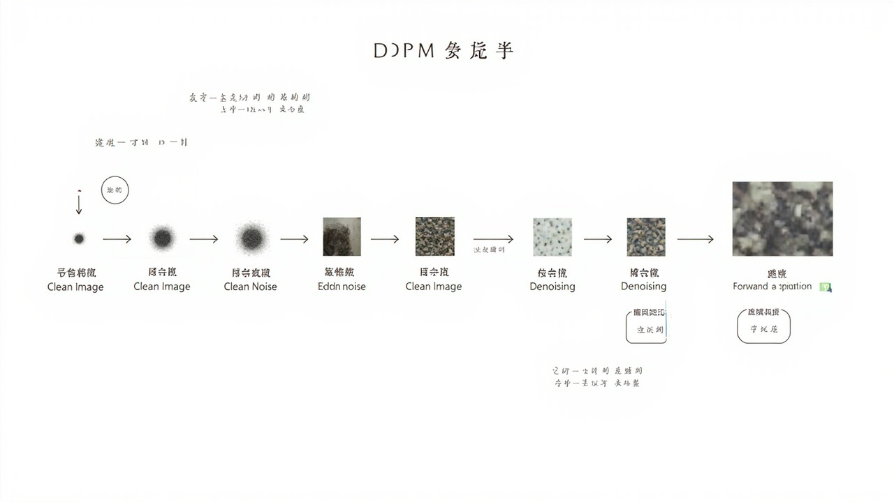

# 扩散模型DDPM

> _通过逐步去噪生成高质量图像的新一代生成模型_

---

## 🎯 先看一个生活中的例子

### 例子：雕刻大理石雕像




假设你要雕刻一座大卫像：

```
正向过程（扩散）：
你手里有一块大理石（原始数据）
雕刻的过程中，你一刀一刀削去多余的部分
慢慢地，大理石变成了碎片...

逆向过程（去噪）：
你从一堆碎片开始
慢慢地把碎片拼起来
加上细节，打磨光滑
最终得到精美的大卫像！
```

**扩散模型就是通过"逆向工程"来生成数据！**

---

## 🤔 什么是扩散模型？

### 两个过程

```
1. 前向扩散（Forward Process / Diffusion）
   - 给真实图像逐步添加噪声
   - 变成纯噪声

2. 逆向去噪（Reverse Process）
   - 从纯噪声开始
   - 逐步去除噪声
   - 生成新图像
```

### 图示

```
前向扩散（加噪）：
x₀ → x₁ → x₂ → ... → x_T
真实图像   逐渐模糊   纯噪声

逆向去噪（去噪）：
x_T → x_{T-1} → ... → x₂ → x₁ → x₀
纯噪声      逐渐清晰   生成的图像
```

---

## 📐 前向扩散过程

### 逐步加噪

```
给定原始图像 x₀
在第 t 步：
x_t = √(ᾱ_t) × x₀ + √(1 - ᾱ_t) × ε

其中：
- ᾱ_t = Π₁ᵗ αᵢ（累积衰减系数）
- αᵢ = 1 - βᵢ（β 是噪声调度参数）
- ε ~ N(0, I)（标准正态噪声）
```

### 关键性质

```
前向过程可以直接计算任意时刻的图像！

不需要一步步模拟：
x_t = √(ᾱ_t) × x₀ + √(1 - ᾱ_t) × ε

这意味着：
- 可以直接获取任意噪声级别的图像
- 训练时可以直接计算 loss
```

---

## 📐 逆向去噪过程

### 学习逆向过程

```
我们不知道真正的逆向过程 q(x_{t-1} | x_t)

但我们可以用神经网络 p_θ(x_{t-1} | x_t) 来近似

训练目标：让网络学会预测噪声 ε_θ(x_t, t)
```

### 简化版训练目标

```python
# DDPM 的简化目标：预测噪声
def ddpm_loss(model, x0, t, device):
    """
    DDPM 损失函数：让模型学会预测噪声

    参数:
        model: 去噪网络（通常是 U-Net）
        x0: 原始图像
        t: 时间步
        device: GPU/CPU
    """
    # 采样噪声
    epsilon = torch.randn_like(x0)

    # 计算加噪后的图像（可以直接算，不用一步步模拟）
    alpha_bar = torch.cumprod(model.module.alphas, dim=0)
    sqrt_alpha_bar = alpha_bar[t] ** 0.5
    sqrt_one_minus_alpha_bar = (1 - alpha_bar[t]) ** 0.5

    x_t = sqrt_alpha_bar * x0 + sqrt_one_minus_alpha_bar * epsilon

    # 模型预测噪声
    epsilon_pred = model(x_t, t)

    # 损失：预测噪声和真实噪声的均方误差
    loss = nn.functional.mse_loss(epsilon_pred, epsilon)

    return loss
```

---

## 🏗️ 去噪网络：U-Net

### U-Net 结构

```
U-Net 是一种编码器-解码器结构，中间有跳跃连接

            输入 x_t, t
                 ↓
    ┌─────────────────────────┐
    │      Encoder（编码器）     │
    │  下采样，提取特征          │
    │    ↓     ↓     ↓         │
    │  64   128   256           │
    └─────────────────────────┘
                 ↓
    ┌─────────────────────────┐
    │      中间层              │
    │    256 通道              │
    └─────────────────────────┘
                 ↓
    ┌─────────────────────────┐
    │      Decoder（解码器）    │
    │  上采样，恢复尺寸          │
    │    ↑     ↑     ↑         │
    │  128    64    输出        │
    └─────────────────────────┘
                 ↓
           预测噪声 ε_θ
```

### 关键设计：时间嵌入

```python
class TimeEmbedding(nn.Module):
    """时间步嵌入，让网络知道当前在第几步"""
    def __init__(self, dim):
        super().__init__()
        self.linear = nn.Linear(1, dim)

    def forward(self, t):
        # t: (batch_size,) 时间步
        t = t.float().unsqueeze(-1)  # (batch_size, 1)
        return self.linear(t)
```

---

## 💻 完整代码

```python
import torch
import torch.nn as nn
import math

class DDPM(nn.Module):
    """去噪扩散概率模型"""
    def __init__(self, channels=1, hidden_dims=[64, 128, 256], time_dim=128):
        super().__init__()

        self.time_embedding = TimeEmbedding(time_dim)

        # Encoder
        self.encoder = nn.ModuleList()
        in_ch = channels
        for h_dim in hidden_dims:
            self.encoder.append(nn.Sequential(
                nn.Conv2d(in_ch, h_dim, 3, padding=1),
                nn.GroupNorm(8, h_dim),
                nn.SiLU()
            ))
            in_ch = h_dim

        # Decoder
        self.decoder = nn.ModuleList()
        for h_dim in reversed(hidden_dims):
            self.decoder.append(nn.Sequential(
                nn.Conv2d(in_ch + h_dim, h_dim, 3, padding=1),
                nn.GroupNorm(8, h_dim),
                nn.SiLU()
            ))
            in_ch = h_dim

        self.final = nn.Conv2d(in_ch, channels, 3, padding=1)

        # 时间步相关的 MLP
        self.time_mlp = nn.Sequential(
            nn.Linear(time_dim, hidden_dims[-1] * 4),
            nn.SiLU(),
            nn.Linear(hidden_dims[-1] * 4, hidden_dims[-1])
        )

        # 注册噪声调度
        self.register_buffer('betas', self._cosine_beta_schedule(1000))
        self.register_buffer('alphas', 1 - self.betas)
        self.register_buffer('alpha_bar', torch.cumprod(self.alphas, dim=0))

    @staticmethod
    def _cosine_beta_schedule(timesteps, s=0.008):
        """余弦噪声调度"""
        steps = torch.arange(timesteps + 1)
        alphas = timesteps / (timesteps + s) * torch.pi / 2
        alphas = torch.cos(alphas) ** 2
        alphas = alphas / alphas[0]
        betas = 1 - (alphas[1:] / alphas[:-1])
        return torch.clip(betas, 0.0001, 0.02)

    def forward(self, x_t, t):
        """前向传播：预测噪声"""
        # 时间嵌入
        t_emb = self.time_embedding(t)
        t_emb = self.time_mlp(t_emb)

        # Encoder
        hiddens = []
        for layer in self.encoder:
            x_t = layer(x_t)
            hiddens.append(x_t)

        # 中间层 + 时间信息
        x_t = x_t + t_emb[:, :, None, None]

        # Decoder + 跳跃连接
        for layer in self.decoder:
            skip = hiddens.pop()
            x_t = torch.cat([x_t, skip], dim=1)
            x_t = layer(x_t)

        return self.final(x_t)

    @torch.no_grad()
    def sample(self, shape, timesteps=1000):
        """从噪声生成图像"""
        device = next(self.parameters()).device

        # 从纯噪声开始
        x_t = torch.randn(shape).to(device)

        # 逐步去噪
        for t in reversed(range(timesteps)):
            t_batch = torch.full((shape[0],), t, device=device, dtype=torch.long)

            # 预测噪声
            noise_pred = self.forward(x_t, t_batch)

            # 计算均值和方差
            alpha = self.alphas[t]
            alpha_bar = self.alpha_bar[t]
            beta = self.betas[t]

            # 简化版：直接预测均值
            mean = (1 / alpha**0.5) * (x_t - beta / (1 - alpha_bar)**0.5 * noise_pred)

            if t > 0:
                noise = torch.randn_like(x_t)
                x_t = mean + (beta**0.5) * noise
            else:
                x_t = mean

        return x_t
```

---

## 📊 DDPM vs GAN

| 特性 | DDPM | GAN |
|------|------|-----|
| 训练稳定性 | 稳定 | 不稳定（需要平衡 G 和 D）|
| 生成质量 | 高 | 高 |
| 生成速度 | 慢（需要多步迭代）| 快（一步生成）|
| Mode Collapse | 不会 | 容易 |
| 采样多样性 | 好 | 较差 |

---

## 📊 后续改进

### DDPM → DDIM（加速采样）

```
DDPM 需要 1000 步才能生成一张图，太慢了！

DDIM：Denosing Diffusion Implicit Models
- 只需要 50 步或更少
- 生成速度提升 20 倍！
```

### Stable Diffusion

```
Stable Diffusion = 潜空间扩散 + CLIP 文本编码

把扩散过程搬到潜空间（用 VAE 压缩）
- 大幅加速
- 降低显存需求
- 可以根据文本生成图像
```

---

## ✅ 本章小结

| 概念 | 解释 |
|------|------|
| 扩散模型 | 通过逆向去噪生成数据的模型 |
| 前向扩散 | 真实图像逐步加噪变成纯噪声 |
| 逆向去噪 | 从纯噪声逐步去噪生成图像 |
| U-Net | 去噪网络的常用架构 |
| 时间嵌入 | 让网络知道当前在第几步 |
| 噪声调度 | 控制噪声添加/去除的节奏 |

---

## 🔗 继续学习

DDPM 是扩散模型的基础。接下来让我们学习 Stable Diffusion！

👉 [StableDiffusion](./StableDiffusion.md)
