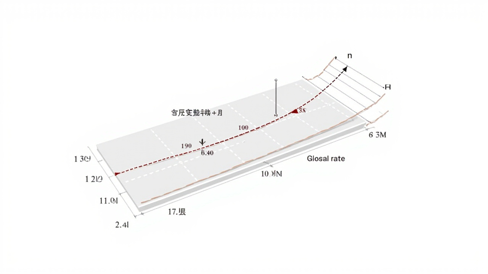

# 梯度下降

> _机器学习优化的核心算法，找到最优参数的秘诀_

---

## 🎯 先看一个生活中的例子

### 例子：下山




想象你在一座大山的某个位置，天黑了，你看不见路，但你知道山脚下有个小镇。你想下山，怎么走？

```
你的策略：
1. 低头看看脚下，感受一下哪个方向是下坡
2. 迈一小步，往下坡的方向走
3. 停下来，再感受一下
4. 再走一步
5. 重复步骤 1-4，直到你觉得已经到了山脚
```

**梯度下降就是这个思路！只不过不是在山上，而是在"损失函数"的曲面上找最低点！**

---

## 🤔 什么是梯度？

### 梯度 = 上升最快的方向

```
在二维曲面上，梯度是一个向量：
- 方向：函数上升最快的方向
- 大小：上升的陡峭程度

负梯度 = 下降最快的方向
```

### 图示

```
        山顶
       /    \
      /      \
     /   ↑↑↑   \    ← 梯度方向（上升最快）
    /    ↓↓↓    \    ← 负梯度方向（下降最快）
   /      \      \
  /        \      \
 /          \      \
/_____________\______\ 山谷（最低点）
```

### 数学定义

```
对于函数 f(x, y)：
梯度 ▽f = (∂f/∂x, ∂f/∂y)

对于一元函数 f(x)：
导数 f'(x) 就是梯度
```

---

## 📐 梯度下降算法

### 核心公式

```
θ_new = θ_old - learning_rate × ▽L(θ)

其中：
- θ 是参数（w, b 等）
- learning_rate 是学习率（步长）
- ▽L(θ) 是损失函数的梯度
- 负号表示往梯度的反方向走（下山）
```

### 直观理解

```
学习率太大：步子迈太大，会在最低点附近振荡，甚至越过
学习率太小：步子太小，收敛太慢
学习率合适：不快不慢，刚刚好
```

---

## 💻 代码实现

### 一维梯度下降

```python
import numpy as np

def gradient_descent_1d(f, f_grad, x_init, learning_rate=0.1, epochs=100):
    """
    一维梯度下降

    参数:
        f: 目标函数
        f_grad: 目标函数的梯度
        x_init: 初始位置
        learning_rate: 学习率
        epochs: 迭代次数
    """
    x = x_init
    history = [x]  # 记录路径

    for epoch in range(epochs):
        grad = f_grad(x)  # 计算梯度
        x = x - learning_rate * grad  # 更新
        history.append(x)

        if (epoch + 1) % 20 == 0:
            print(f"Epoch {epoch+1:3d}: x = {x:.6f}, f(x) = {f(x):.6f}, grad = {grad:.6f}")

    return x, history


# 例子：最小化 f(x) = x²
def f(x):
    return x ** 2

def f_grad(x):
    return 2 * x

# 从 x=5 开始下山
x_opt, history = gradient_descent_1d(f, f_grad, x_init=5.0, learning_rate=0.1, epochs=50)

print(f"\n最优解: x = {x_opt:.6f}")
print(f"最小值: f(x) = {f(x_opt):.6f}")
```

---

## 📐 三种梯度下降变体

### 1. 批量梯度下降（BGD）

```
每次使用所有样本计算梯度

优点：方向准确，收敛稳定
缺点：样本多时很慢
```

```python
def batch_gradient_descent(X, y, lr=0.01, epochs=1000):
    """批量梯度下降"""
    m, n = X.shape
    w = np.zeros(n)

    for epoch in range(epochs):
        # 使用所有样本计算梯度
        y_pred = X @ w
        error = y_pred - y
        gradient = X.T @ error / m
        w = w - lr * gradient

    return w
```

### 2. 随机梯度下降（SGD）

```
每次只用一个样本计算梯度

优点：快，可以跳出局部最优
缺点：方向不稳定，有噪声
```

```python
def sgd(X, y, lr=0.01, epochs=1000):
    """随机梯度下降"""
    m = len(y)
    w = np.zeros(X.shape[1])

    for epoch in range(epochs):
        # 随机打乱顺序
        indices = np.random.permutation(m)

        for i in indices:
            xi, yi = X[i:i+1], y[i]
            y_pred = xi @ w
            error = y_pred - yi
            gradient = xi.T * error
            w = w - lr * gradient.flatten()

    return w
```

### 3. 小批量梯度下降（Mini-Batch GD）

```
每次使用一小批（batch）样本

优点：平衡速度和准确性
缺点：需要选择 batch_size
```

```python
def mini_batch_gd(X, y, batch_size=32, lr=0.01, epochs=1000):
    """小批量梯度下降"""
    m = len(y)
    w = np.zeros(X.shape[1])

    for epoch in range(epochs):
        # 随机打乱
        indices = np.random.permutation(m)

        for start in range(0, m, batch_size):
            end = min(start + batch_size, m)
            batch_indices = indices[start:end]

            X_batch = X[batch_indices]
            y_batch = y[batch_indices]

            y_pred = X_batch @ w
            error = y_pred - y_batch
            gradient = X_batch.T @ error / batch_size
            w = w - lr * gradient

    return w
```

### 三种方法的对比

```
BGD（全部数据）：
    ●━━━━━━━━━━━━━━━━━━━━━━━━━━→ 一路下山，稳稳当当

SGD（单个样本）：
    ●→↘→↓→↗→●→↘→↓→...      曲曲折折，但总体下山

Mini-Batch（32-256个样本）：
    ●━━━━━→↓━━━━━→●         折中，速度和稳定性平衡
```

---

## ⚠️ 学习率调优

### 学习率的影响

```
学习率太大学习率太小  学习率合适
    ↓              ↓            ↓
   ●→↘↗→↘↗→↘↗    ●→↓→↓→↓→...    ●→↓
  振荡发散/振荡    收敛极慢     快速收敛
```

### 学习率调度策略

```python
# 1. 固定学习率
lr = 0.01

# 2. 阶梯衰减
if epoch % 30 == 0:
    lr = lr * 0.5

# 3. 指数衰减
lr = lr * (0.95 ** epoch)

# 4. 余弦退火
lr = lr_min + (lr_max - lr_min) * (1 + cos(epoch / total_epochs * pi)) / 2
```

---

## 🌟 Adam 优化器

### Adam 的核心思想

```
Adam = Adaptive Moment Estimation

结合了两个想法：
1. Momentum：用历史梯度的加权平均
2. RMSProp：用历史梯度平方的加权平均

自适应调整每个参数的学习率！
```

### Adam 的公式

```
1. 计算梯度：
   g_t = ▽L(θ_t)

2. 计算一阶矩估计（类似动量）：
   m_t = β₁ · m_{t-1} + (1 - β₁) · g_t

3. 计算二阶矩估计（类似 RMSProp）：
   v_t = β₂ · v_{t-1} + (1 - β₂) · g_t²

4. 修正偏差：
   m̂_t = m_t / (1 - β₁^t)
   v̂_t = v_t / (1 - β₂^t)

5. 更新参数：
   θ_t = θ_{t-1} - lr · m̂_t / (√v̂_t + ε)

常用超参数：
- β₁ = 0.9（一阶矩）
- β₂ = 0.999（二阶矩）
- ε = 1e-8（防止除零）
```

### Adam 代码实现

```python
def adam(X, y, lr=0.001, epochs=1000, beta1=0.9, beta2=0.999, eps=1e-8):
    """Adam 优化器"""
    m, n = X.shape
    w = np.zeros(n)
    v = np.zeros(n)  # 二阶矩

    m_hat = np.zeros(n)  # 一阶矩（有偏差修正）
    v_hat = np.zeros(n)  # 二阶矩（有偏差修正）

    for epoch in range(epochs):
        # 前向传播
        y_pred = X @ w
        error = y_pred - y
        gradient = X.T @ error / m

        # 更新一阶矩
        m = beta1 * m + (1 - beta1) * gradient

        # 更新二阶矩
        v = beta2 * v + (1 - beta2) * gradient ** 2

        # 修正偏差
        m_hat = m / (1 - beta1 ** (epoch + 1))
        v_hat = v / (1 - beta2 ** (epoch + 1))

        # 更新参数
        w = w - lr * m_hat / (np.sqrt(v_hat) + eps)

    return w
```

---

## 📊 优化器对比

| 优化器 | 特点 | 适用场景 |
|-------|------|---------|
| SGD | 简单，稳定 | 通用 |
| Momentum | 加速收敛，减少振荡 | 深度网络 |
| RMSProp | 自适应学习率 | RNN、非稳态问题 |
| Adam | 结合 Momentum 和 RMSProp | 默认选择 |
| AdamW | Adam + 权重衰减 |  transformers |

---

## ✅ 本章小结

| 概念 | 解释 |
|------|------|
| 梯度 | 函数上升最快的方向 |
| 负梯度 | 函数下降最快的方向 |
| 学习率 | 每一步走多远 |
| BGD | 用全部样本，收敛稳定但慢 |
| SGD | 用单个样本，快但不稳定 |
| Mini-Batch | 用一批样本，平衡速度和稳定性 |
| Momentum | 动量，加速收敛，减少振荡 |
| Adam | 自适应学习率，默认优化器 |

---

## 🔗 继续学习

梯度下降是所有机器学习优化算法的基础。恭喜你完成了所有机器学习基础算法的学习！

👉 [返回机器学习目录](./README.md)
